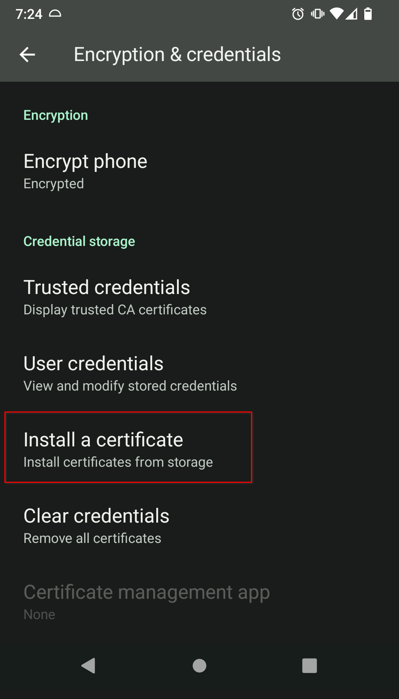

# Trusting Your Root CA (Android/Graphene)

This guide applies to Android 13+, GrapheneOS, CalyxOS, and LineageOS

1. Ensure you have [downloaded your Root CA](../../../user-manual/trust-ca.md#download-your-root-ca).

1. Go to `Settings > Security > More security settings > Encryption & credentials > Install a certificate > CA Certificate > Install Anyway`, then select your custom-named `adjective-noun.crt` certificate.

   

1. If using Firefox, you must use <a href="https://play.google.com/store/apps/details?id=org.mozilla.firefox_beta" target="_blank">Firefox Beta</a>, then complete [this final step](../../firefox-guides/ca.md#android--graphene).
