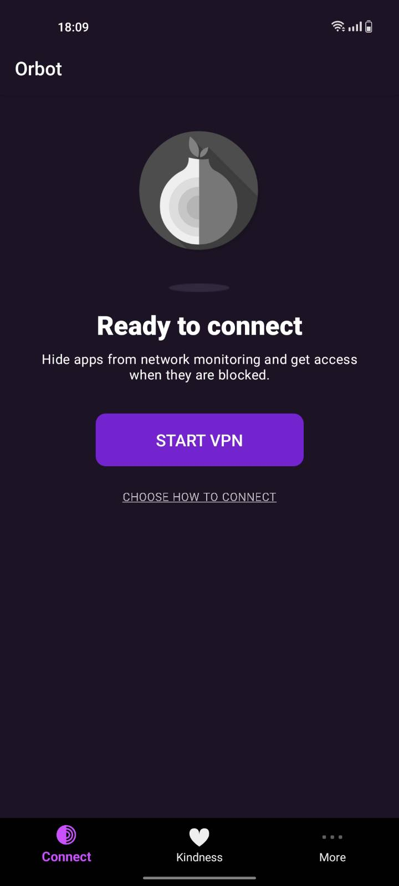
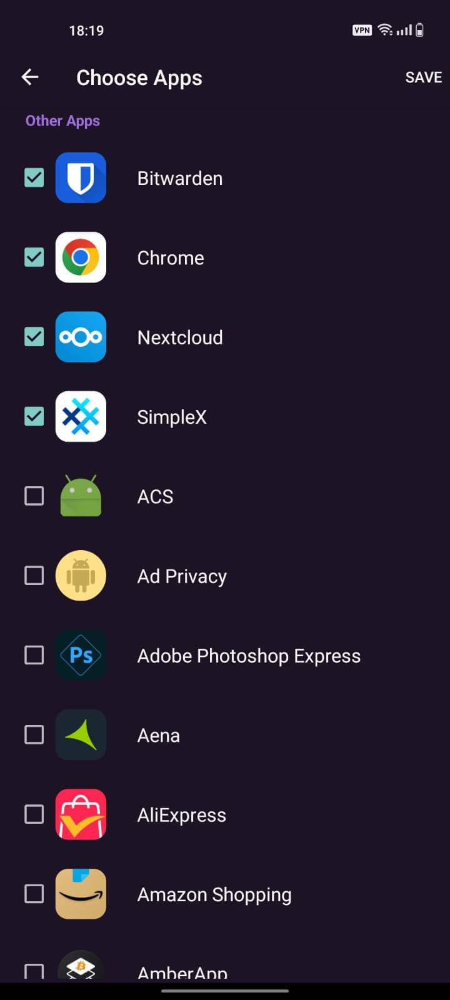

# Connecting via Tor (Android/Graphene)

Some apps have Tor built-in; they do not require additional software or configurations. Most apps, however, do not have Tor built-in. To use them with Tor, you must install and run Orbot on your Android device.

#### Contents

- [Running Orbot](#running-orbot)
- [Connecting Apps](#connecting-apps)

## Running Orbot

1. Install Orbot from the <a href="https://play.google.com/store/apps/details?id=org.torproject.android" target="_blank">Play Store</a> or F-Droid.

```admonish tip
For F-Droid, enable the Guardian Project repository by going to `F-Droid > Settings > Repositories > Guardian Project Official Releases`
```

1. Open Orbot and click "Start VPN":

   

1. In **Android settings**, go to `Settings > Network & Internet > Advanced > Private DNS` and toggle Private DNS to "off".

## Connecting Apps

Apps with Socks5 support can use Orbot as-is; there is no need to add them to the list of "VPN apps" in Orbot. Other apps, however, must to be added. Check the instructions for your app.

1. In Orbot, click "Choose Apps" and select the apps you want to utilize Tor.

   
