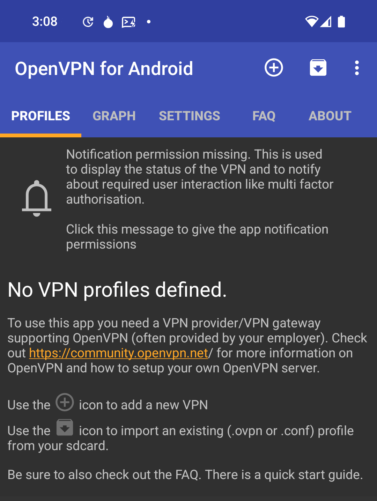
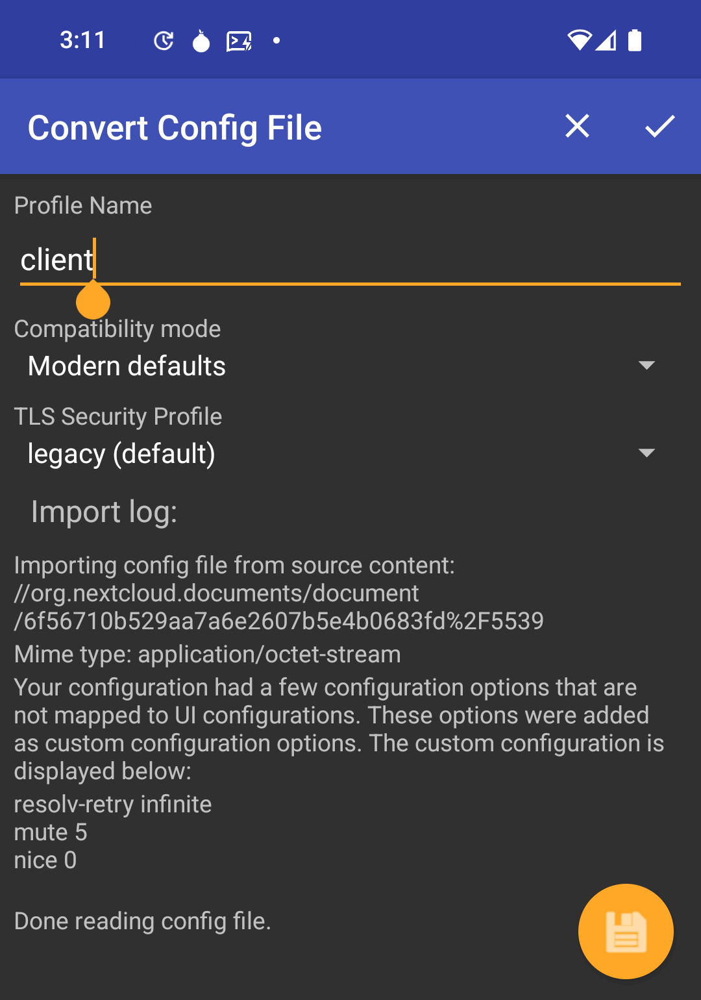
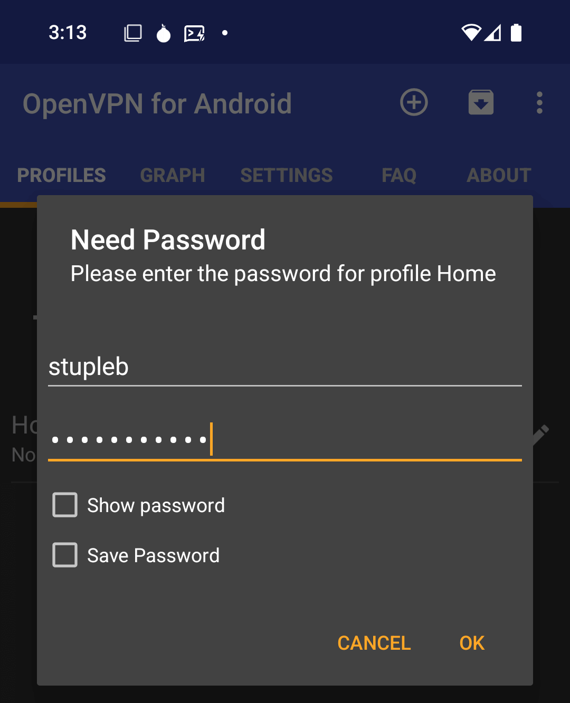
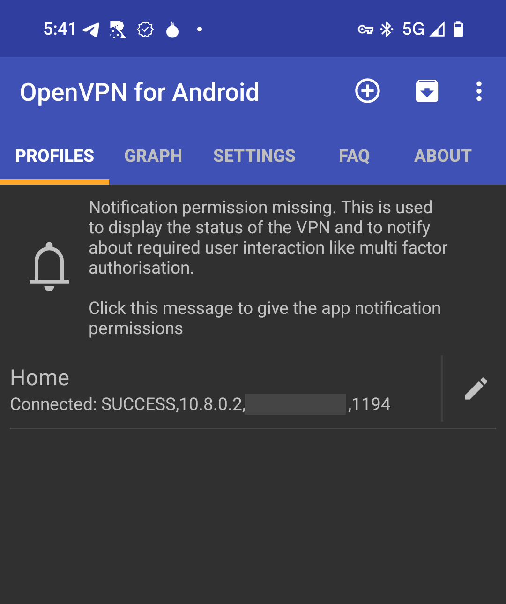
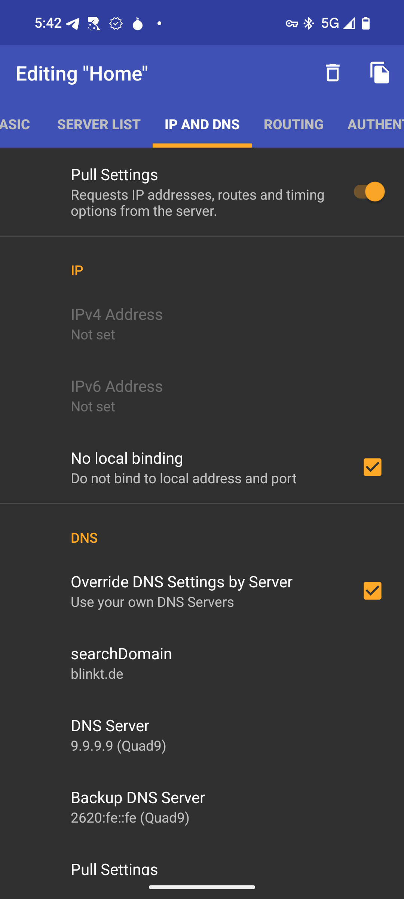
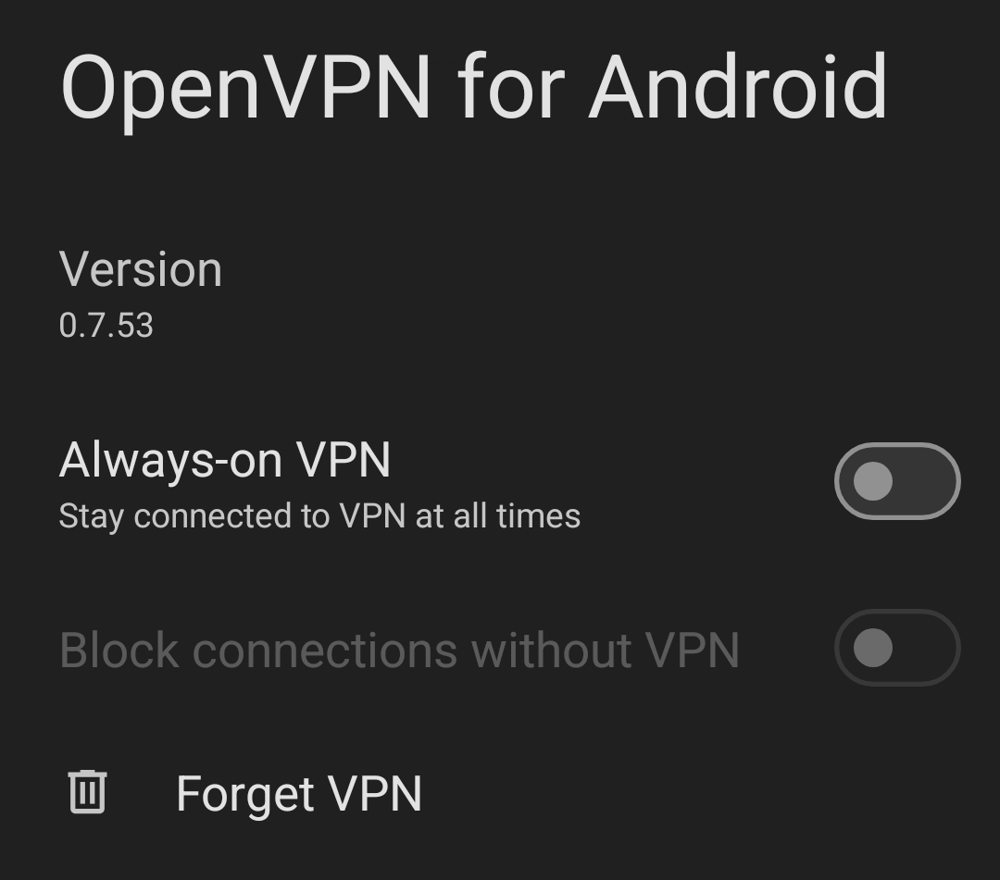
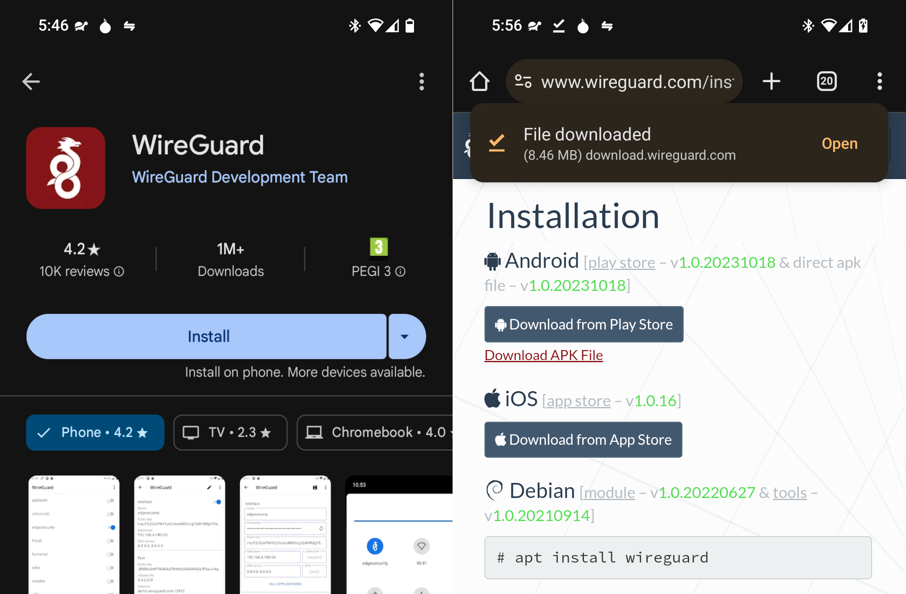
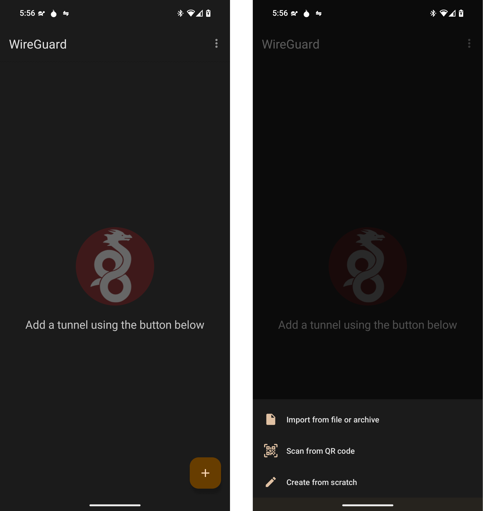
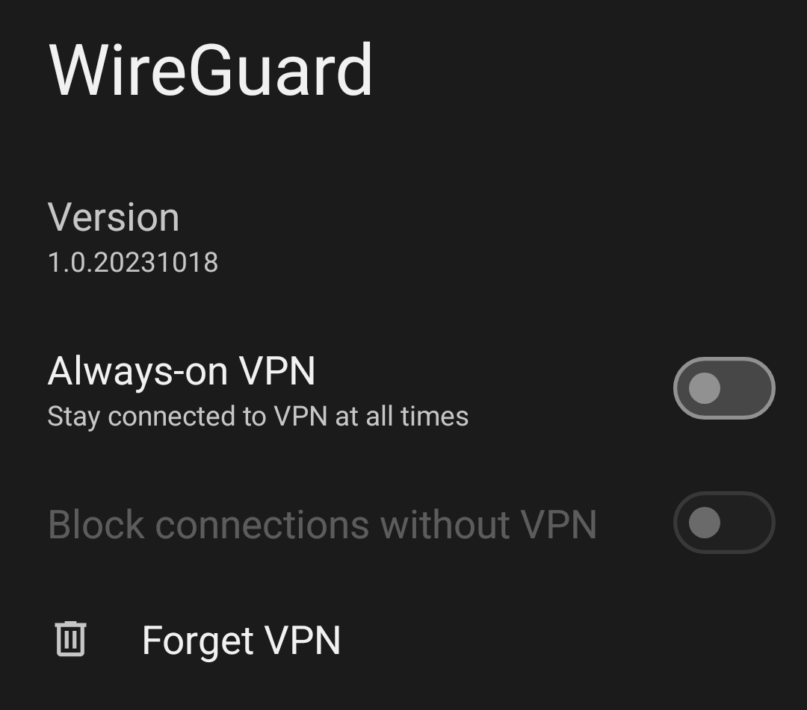
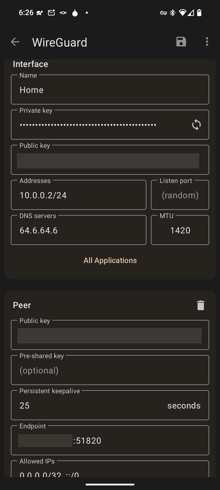

# Using a VPN (Android/Graphene)

#### Contents
- [OpenVPN](#openvpn)
- [WireGuard](#wireguard)

## Prerequisites
Most modern routers have VPN functionality built-in. You'll need to configure your router to assign a static IP to your Start9 server and to setup a OpenVPN or WireGuard server on your router, depending on which it supports.

The VPN client you set up will allow you to read and add your VPN configuration from your Router VPN server. You'll also use it to easily connect and disconnect from your Router VPN server just like you would a comercial VPN app to a third-party VPN server.

## OpenVPN

Slightly slower, but with more authentication options, including creation of individual users with passwords.

### Automatic
1. On your Android device, install the **OpenVPN for Android** client from [Google Play](https://play.google.com/store/apps/details?id=de.blinkt.openvpn), [F-Droid](https://github.com/schwabe/ics-openvpn) or the APK from Arne Schwabe's [Github](https://github.com/schwabe/ics-openvpn) repo. As an alternative you can also use **OpenVPN Connect** from [OpenVPN, Inc.](https://openvpn.net/client/).

1. Download the configuration file from your router's VPN server to your device. How you configure this is up to you. Typically the main concern is whether you like connections to be made with a username or password, or with just a certificate, or both.

    

1. Add a new profile by clicking on the '+'

    

1. Choose to Import from the file you have downloaded to your phone, then consider giving the profile a better name, and then click save.

    

1. Android will inform you that OpenVPN wants to set up a VPN connection. Click 'OK'.

1. If you set up your OpenVPN server with username and password authentication, enter those and select to Save Password. 

    

    ```admonish note

    In this guide we are using Password-only, but passwords can be accompanied by certificates for added security.
    
    ```


1. Once set up, click on the name of the profile allows you to connect and disconnect. You can edit the profile from the icon to its right.

    

1. If you're not able to browse websites when connected, your Router VPN may not be providing valid DNS servers. If so, edit the profile and visit the IP and DNS tab. Prder the Pull Settings, but click to override the DNS settings and add your own.

    

```admonish tip
In GrapheneOS, all VPNs are set to be always-on by default. You may need to go into your VPN settings and deactivate this if you want to have connectivity while not connected to your Router VPN.



```

### Manual (not recommended)
1. View or Download the configuration file from your router's VPN server to your device.

1. Head to Network & Internet, then VPN in your Android settings, then click '+' to add a profile.

1. Complete the fields according to your configuration file.

## WireGuard

Simpler and faster, its limitation is that it authenticates with keys rather than usernames and passwords (which might be easier to distribute to family/friends or others you share access to). You would create a WireGuard profile on your router's WireGuard Server for each device you want to connect to the VPN and follow the guide below on each device, importing the profile you created for that device.

### Automatic

1. On your Android device, install the WireGuard client from Google Play or the APK from [WireGuard](https://www.wireguard.com/install/). You'll use this to read and automatically add your VPN configuration from your Router VPN server into Android. You'll also use it as you would a typical VPN client app to easily connect and disconnect from your Router VPN server as you would from a third-party VPN server.

    

1. Download the configuration file from your router's VPN server to your device (or if applicable, display a QR code)

    

1. Add a new tunnel from the file downloaded to your device (or scan the QR code) by clicking on the '+'

    

1. Android will inform you that Wireguard wants to set up a VPN connection. Click 'OK'.

1. Your VPN tunnel will have been created and visible in both Android's system menus and conveniently in the WireGuard app where there is a quick toggle.

```admonish tip
In GrapheneOS, all VPNs are set to be always-on by default. You may need to go into your VPN settings and deactivate this if you want to have connectivity while not connected to your Router VPN.



```


### Manual

1. View the configuration from your router's VPN server with your client device in hand.

    

1. Add an interface and manually add the address, private key, DNS and MTU details provided by your router.

    

1. Click to Add Peer then add the public key, endpoint, keep alive and allowed IPs provided by your router.

1. Android will inform you that Wireguard wants to set up a VPN connection. Click 'OK'.

1. Your VPN tunnel will have been created and visible in both Android's system menus and conveniently in the Wireguard app where there is a quick toggle.