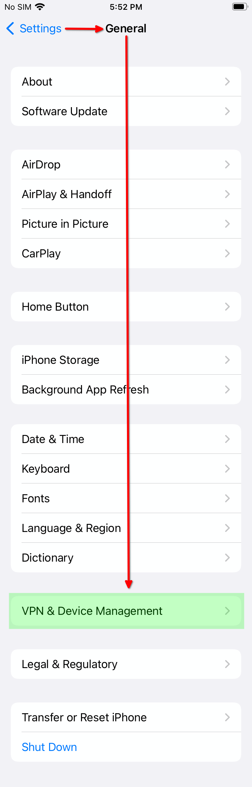
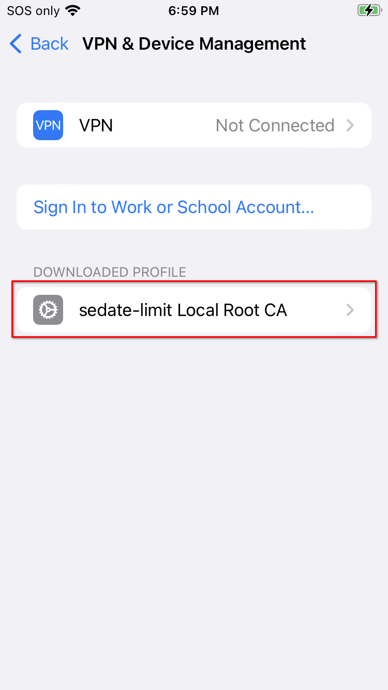
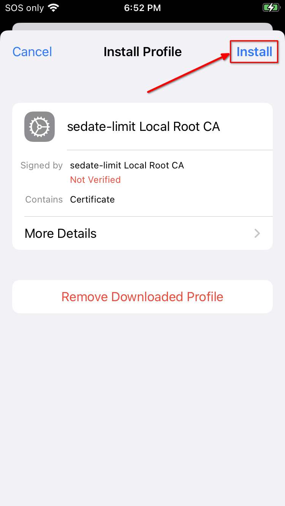
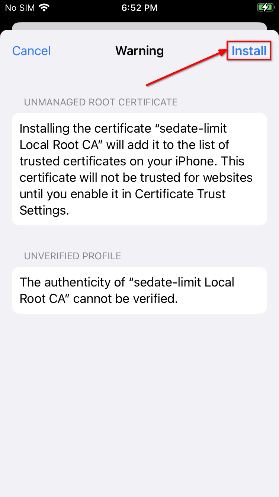
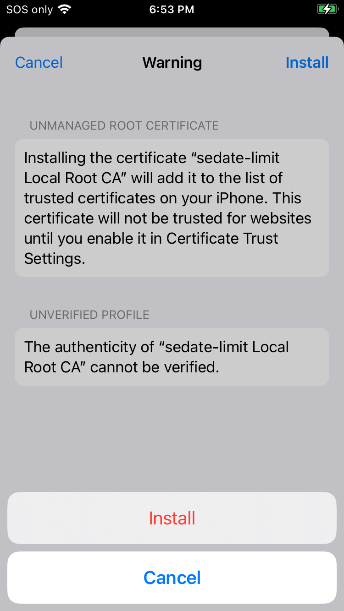
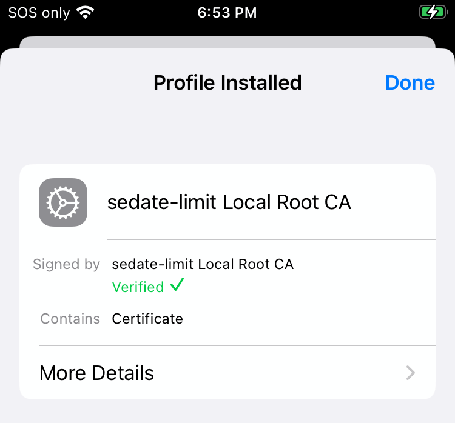

# Trusting Your Root CA (iOS)

1. Ensure you have [downloaded your Root CA](../../../user-manual/trust-ca.md#download-your-root-ca).

1. Open your iCloud Downloads folder and click on the certificate. It will display a dialog box that says `Profile Downloaded`. Click "Close".

1. Head to _Settings > General > VPN & Device Management_:

   

1. Under "DOWNLOADED PROFILE", click your Root CA:

   

1. Click "Install":

   

1. Click "Install" again:

   

1. Click "Install" for a 3rd time:

   

1. You should see green text with a check-mark saying "Verified" under the Profile Installed dialog:

   

   ```admonish note

   On recent versions of iOS this check-mark does not appear. It may return in the next version of iOS if removing it was a mistake.
    
   ```


1. Tap "Done".

1. Go to `General > About > Certificate Trust Settings` and enable your Root Ca:

   

1. Click "Continue".
