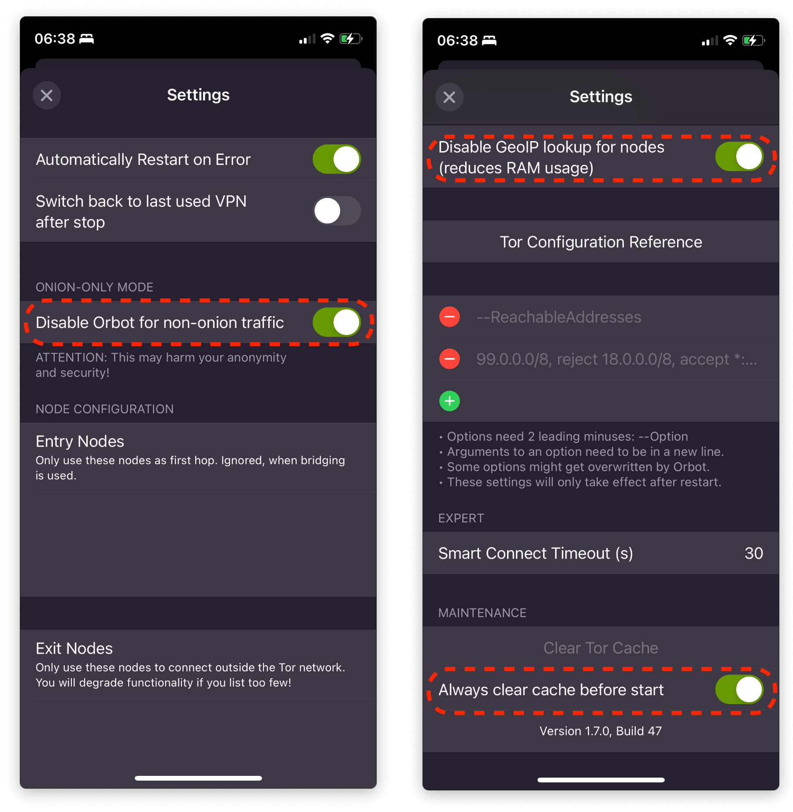
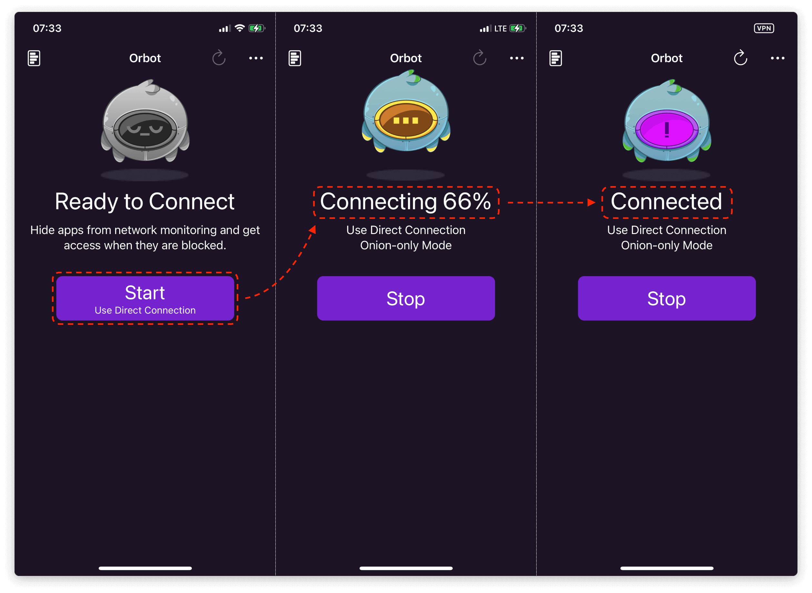

# Connecting over Tor (iOS)

Some apps have Tor built-in; they do not require additional software or configurations. Most apps, however, do not have Tor built-in. To use them with Tor, you must install and run Orbot on your iOS device.

1.  Install [Orbot](https://apps.apple.com/app/orbot/id1609461599).

1.  In Orbot, click "Settings" and configure the following:

    1. "Disable Orbot for non-onion traffic" -> On
    1. "Disable GeoIP lookup for nodes" -> On
    1. "Always clear cache before start" -> On

    

1.  Go back to the main screen and click "Start".

    
