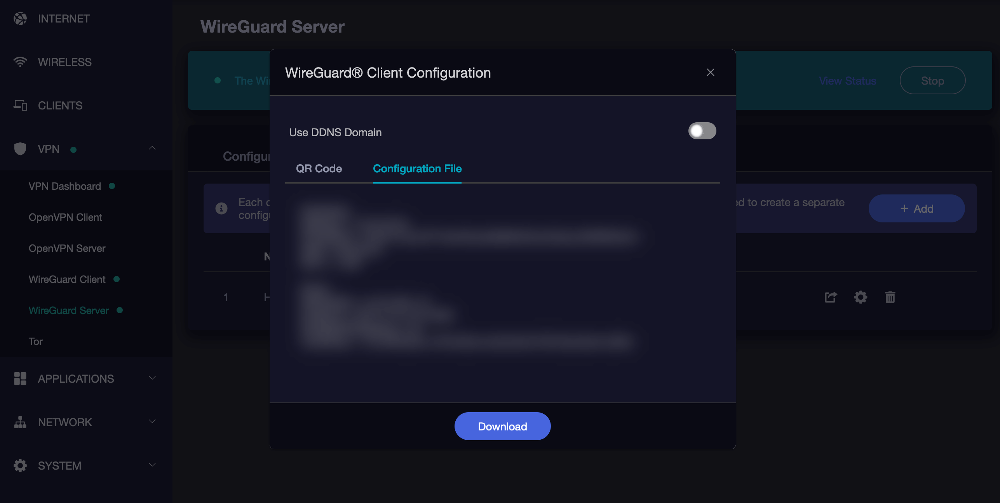
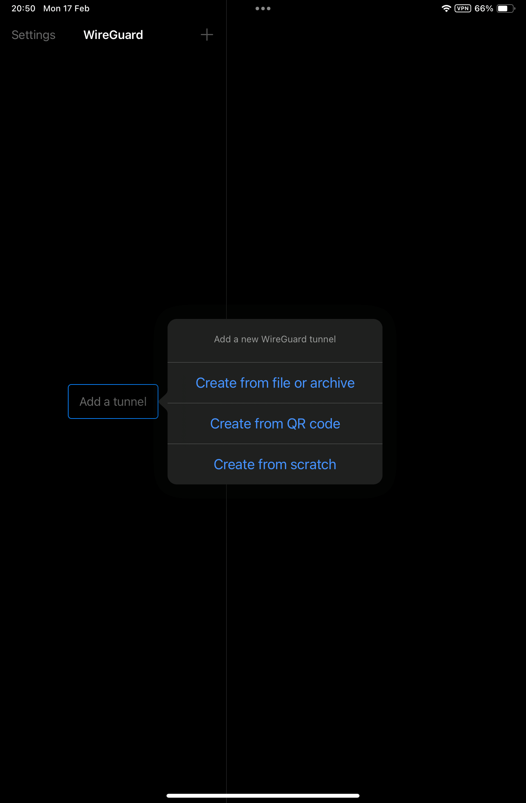
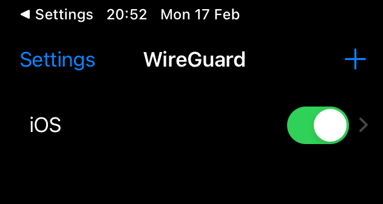
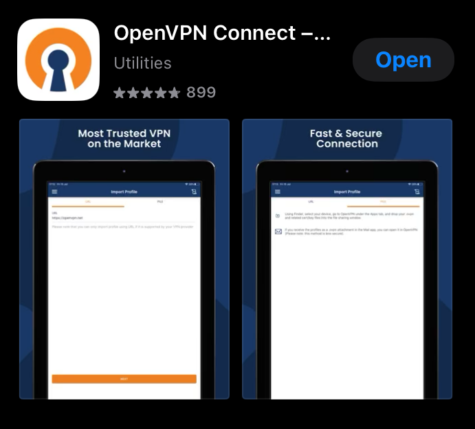
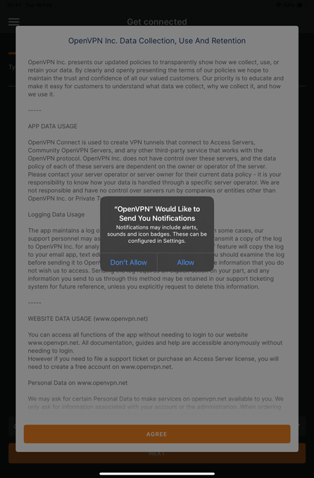
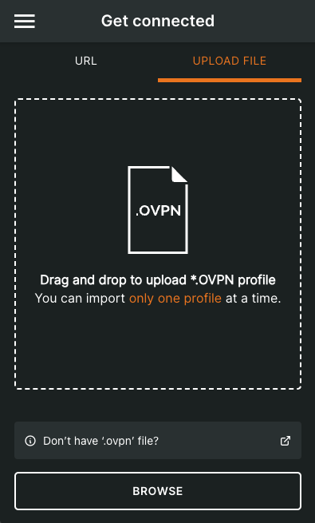
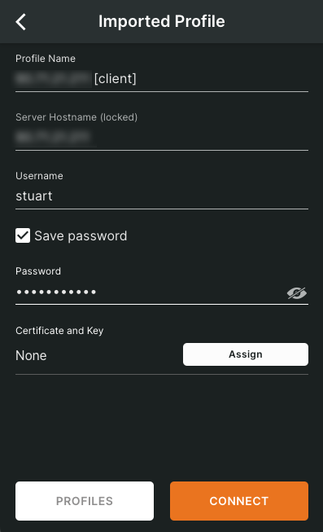
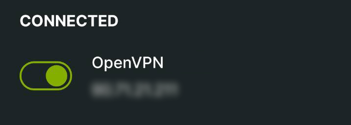

# Connecting via Router VPN (iOS)

Follow this guide to connect your iOS device to your Router VPN in order to access your StartOS server and installed services.

#### Prerequisites

- [Connecting Remotely - Router VPN](../../user-manual/connecting-remotely/vpn.md)

#### Contents

- [WireGuard](#wireguard)
- [OpenVPN](#openvpn)

## WireGuard

1. In your router's WireGuard server, create a new profile/configuration for your iOS device.

   

1. Install WireGuard from the [App Store](https://itunes.apple.com/us/app/wireguard/id1441195209?ls=1&mt=8).

   

1. Click `Add a tunnel`.

1. Import the configuration file created above to your iOS device. If the configuration file can be displayed as a QR code, that is usually easiest. If not, you can download the file and transfer it to your iOS device.

   

   

1. Your VPN tunnel will have been created and visible in the WireGuard app where you can click to activate it.

   

## OpenVPN

1. Install OpenVPN Connect from the [App Store](https://itunes.apple.com/us/app/openvpn-connect/id590379981?mt=8).

   

1. Click to accept notifications, accept terms etc.

   

1. Download the configuration file from your router's OpenVPN server to your IOS device. If accessing your router UI via a laptop/desktop, you will need to download the file to that device, then send it to yourself via email, message, or other file sharing tool.

   

1. Import the configuration file and enter the necessary authentication settings you chose or were default on your OpenVPN Server on your router

   

1. Depending on how you've configured your OpenVPN server, you may need to add a username and password before you hit Connect.

   

1. Once set up, click on the name of the profile allows you to connect and disconnect. You can edit the profile from the icon to its right.

   
