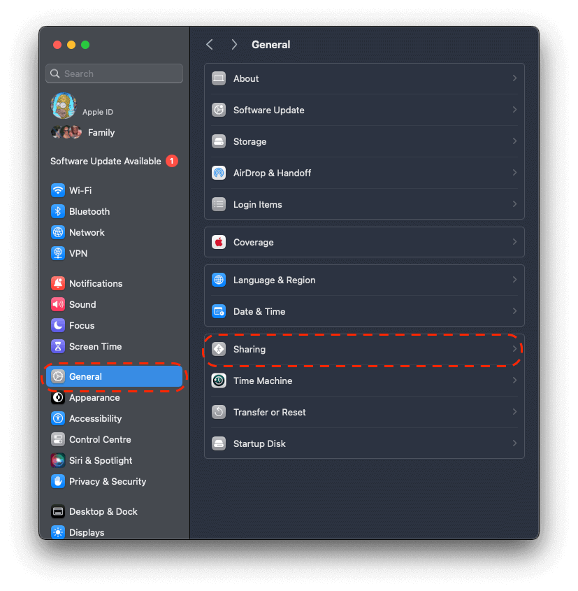

# Creating Backups to Mac

#### Contents

1. [Create a Shared Folder](#create-a-shared-folder)
1. [Create a backup](#create-a-backup)

## Create a Shared Folder

1. Identify or create a folder to store your server backups.

   ```admonish tip

    This folder can be located on an external drive connected to your Mac.
   ```

1. Go to `System Settings > General > Sharing` and click the "info" icon:

    
    

1. Click the toggle to enable file sharing, then click the "plus" icon and select your backups folder.

   


1. Click "Options".

1. Select the user who owns the folder.

1. You can now move in to Create a Backup


   ```admonish tip

    You can find the hostname at the top of sharing window. The hostname will be an address beginning with smb://. To use as hostname disregard the smb:// and simply enter the ip address that follows it. You will need this in the next step. Alternatively you can use the computer hostname. (See directions below) Either method will work.
   ```


## Create a Backup

1.  In StartOS, go to `System > Create Backup`.

1.  Click "Open New".

1.  Complete the form:

    1.  **Hostname**: The name of your Mac. Check the tip in Step 5 of the section above to find it. On some versions of Mac, you may need to open up Terminal and type `hostname`.

    1.  **Path** - The _name_ of your shared folder, _not_ the full directory path.

    1.  **Username** - Your Mac user who owns the shared folder.

    1.  **Password** - Your password for the above user.

1.  Click "Connect".

    ```admonish warning title="Troubleshooting"

    - If you receive `Filesystem I/O Error mount error(13): Permission denied`, ensure you have entered all the correct values in the form. The hostname can be particularly tricky.

    - **MacOS Catalina (version 10.15.7)** If the backup fails, please see this [Apple support thread](https://discussions.apple.com/thread/253970425). If the provided solution does not work, you will either need to update your Mac or use a physical drive for backups.

    - **MacOS Ventura (version 13.2)** If you recently updated to Ventura, and you cannot get the folder to connect, do the following: in `System Settings > General > Sharing`, turn off file sharing, restart your mac, then turn file sharing back on.
    ```
