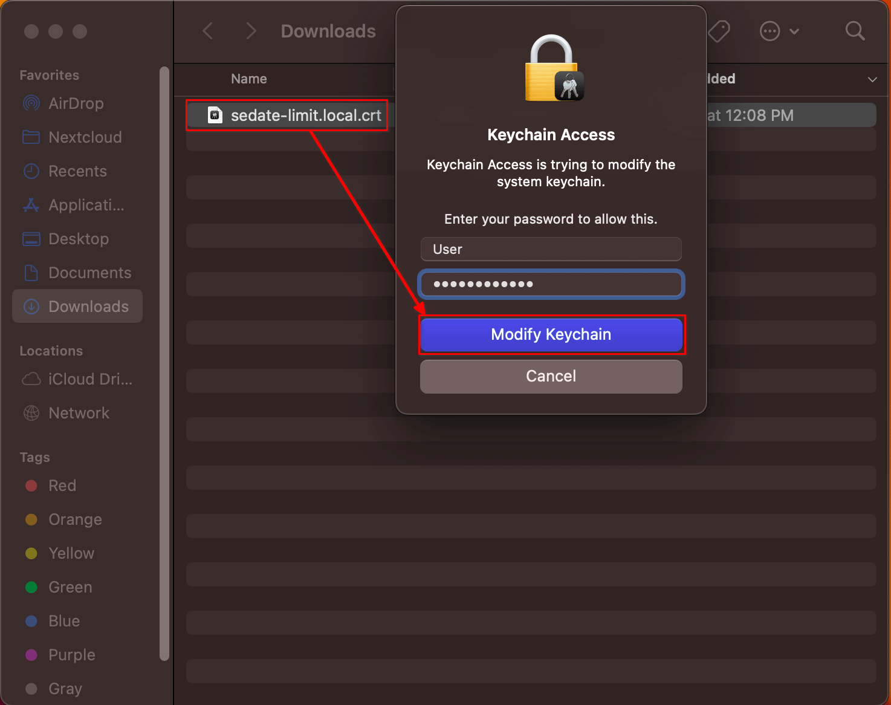

# Trusting Your Root CA (Mac)

1. Ensure you have [downloaded your Root CA](../../../user-manual/trust-ca.md#download-your-root-ca).

1. Locate your Root CA and double click it. Keychain Access will launch. You will be prompted for your Mac credentials. Select "Modify Keychain".

   

1. Press Command + Spacebar to launch a program, type in Keychain Access and select the resulting Keychain Access program to open it.

1. Your server's CA certificate will be displayed among the imported certificates in Keychain Access. Right-click on the imported CA cert and select _Get Info_:

1. The details of your CA certificate will be displayed in a new dialog window. Click the "Trust" heading, then select "Always Trust" on **Secure Sockets Layer (SSL)** and **X.509 Basic Policy**.

Click the red (x) button at the top left of the Local Root CA dialog window.

1. You will then be prompted again for your Mac credentials. Click **Update Settings**:

1. You will see your server's CA certificate as trusted now, signified by a blue (+) sign and the CA cert information will now say "This certificate is marked as trusted for all users" in Keychain Access:

1. If using Firefox or Tor Browser, complete this [final step](../../firefox-guides/ca.md#mac--windows)
