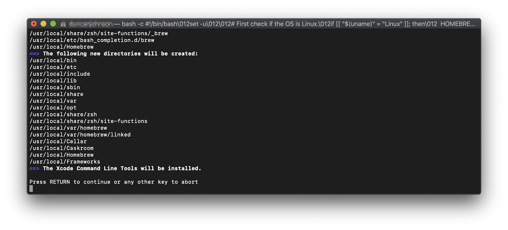
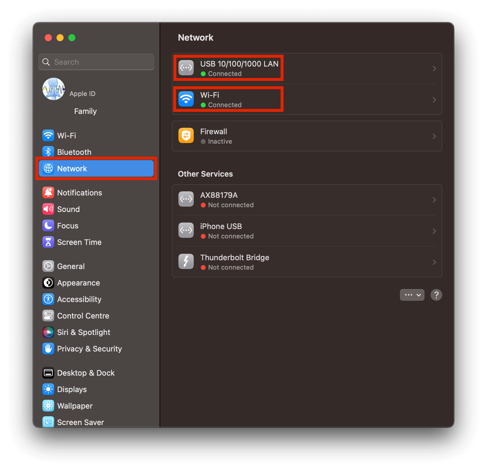
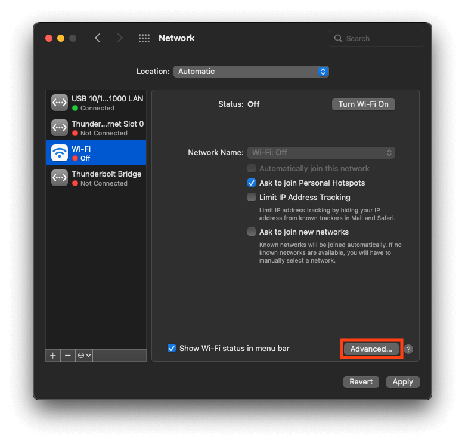

# Running Tor (Mac)

#### Contents

1. [Install Homebrew](#install-homebrew)
1. [Install Tor](#install-tor)
1. [Enable Tor System Wide](#enable-tor-system-wide)

## Install Homebrew

1.  If you do not already have Homebrew installed, follow the installation instructions <a href="https://brew.sh/" target="_blank">here</a>. TLDR: Open the Terminal and paste the following line:

        /bin/bash -c "$(curl -fsSL https://raw.githubusercontent.com/Homebrew/install/HEAD/install.sh)"

1.  You will be prompted for your system password before installation; proceed with entering your password. You may be asked more than once.

1.  You will be notified which directories Homebrew is going to create. Hit `RETURN`:

    

1.  Homebrew may take a few minutes to download and install everything it needs.

    ```admonish warning

    Homebrew uses Google Analytics to collect anonymous usage data. You can deselect the option to share usage data by <a href="https://docs.brew.sh/Analytics#opting-out" target="_blank">opting out</a>
    ```

## Install Tor

1.  If you have the Tor Browser open, close it and quit the application.

    ```admonish note

    If you are on a very old version of macOS, such as High Sierra (10.13) or below, first execute this command in a Terminal window, then close the Terminal app.

         echo 'export PATH="/usr/local/bin:$PATH"' >> ~/.bash_profile
    ```

1.  Open the Terminal app and install Tor using the following command:

        brew install tor

1.  Then start Tor with:

        brew services start tor

    This will start Tor and ensure that it is always running, even after a restart. See the <a href="https://2019.www.torproject.org/docs/tor-doc-osx.html.en" target="_blank">Tor Project docs</a> for more details.

## Enable Tor System-Wide

**Content**

1. [Sonoma](#sonoma-macos-14)
1. [Pre-Sonoma](#pre-sonoma)

### Sonoma (MacOS 14)

1.  Enable the proxy autoconfig file (This will download the Start9 standard proxy config file. You can use your own if you prefer):

        sudo curl https://start9.com/assets/proxy.pac --output /Library/WebServer/Documents/proxy.pac

1.  Enable Apache:

        sudo launchctl enable system/org.apache.httpd
        sudo launchctl kickstart system/org.apache.httpd

1.  Go to `System Settings > Network` and select the interface to edit. We recommend editing both Ethernet and WiFi. First do one, then the other:

    <!-- @TODO -->

    

1.  Click `Details > Proxies` and paste the following URL into "Automatic Proxy Configuration": `http://localhost/proxy.pac`. Click "OK".

    <!-- @TODO -->

    

1.  Repeat the previous two steps for Wifi/Ethernet, depending on which interface you haven't done yet.

## Pre-Sonoma (MacOS 13 and Older)

1.  Enable the proxy autoconfig file (This will download the Start9 standard proxy config file. You can use your own if you prefer):

        sudo curl https://start9.com/assets/proxy.pac --output /Library/WebServer/Documents/proxy.pac

1.  Enable Apache:

        sudo launchctl load -w /System/Library/LaunchDaemons/org.apache.httpd.plist

1.  Go to `System Preferences > Network` and select the interface to edit. We recommend editing both Ethernet and WiFi. First do one, then the other:

    <!-- @TODO -->

    

1.  Click `Advanced > Proxies` and paste the following URL into "Automatic Proxy Configuration": `http://localhost/proxy.pac`

    <!-- @TODO -->

    

1.  Repeat the previous two steps for Wifi/Ethernet, depending on which interface you haven't done yet.
