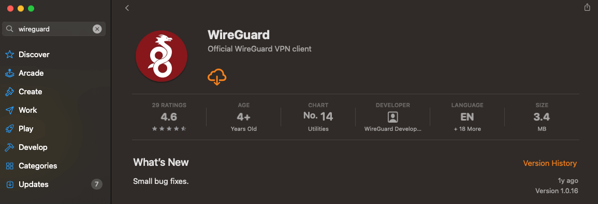
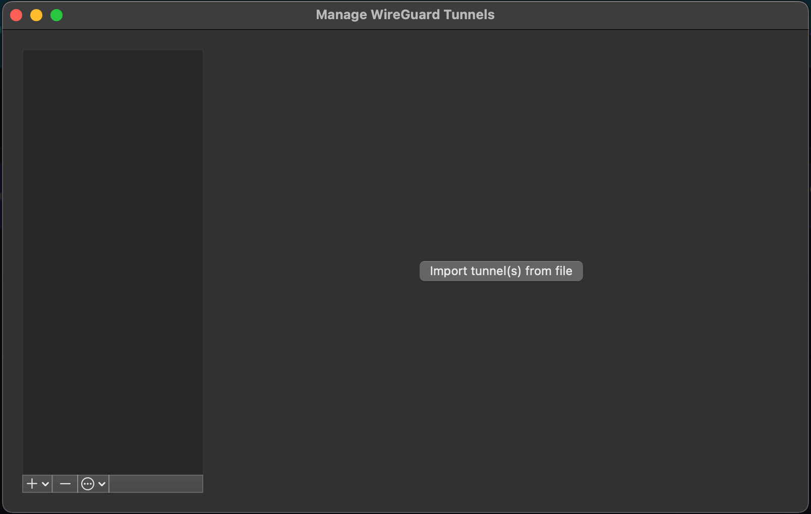
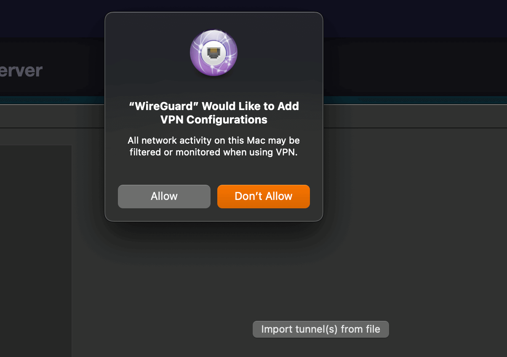
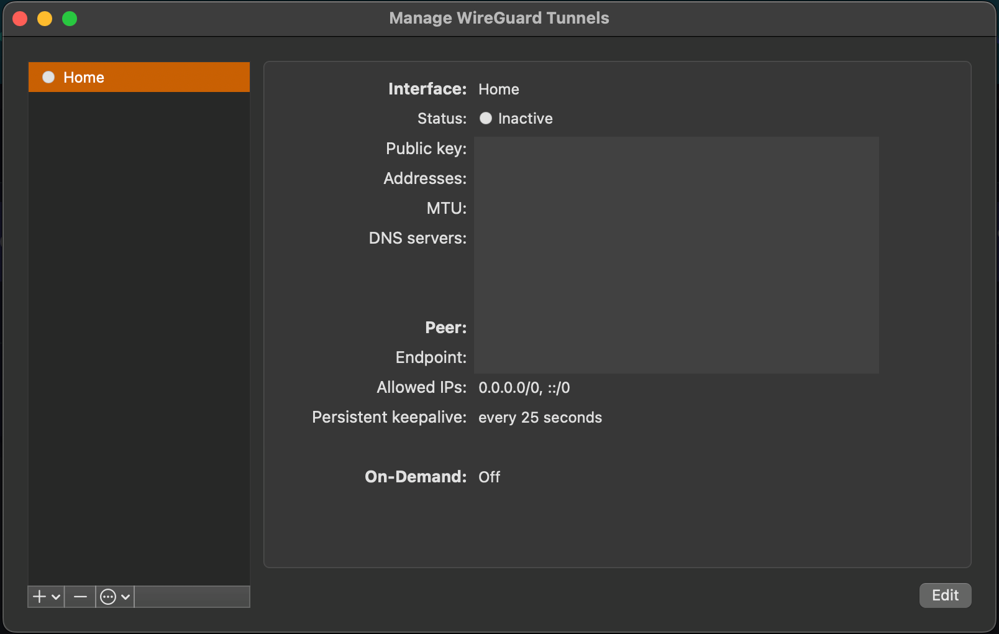

# Using a VPN (Mac)

#### Contents
- [OpenVPN](#openvpn)
- [WireGuard](#wireguard)

## Prerequisites
Most modern routers have VPN functionality built-in. You'll need to configure your router to assign a static IP to your Start9 server and to setup a OpenVPN or Wireguard server on your router, depending on which it supports.

## OpenVPN

Slightly slower, but with more authentication options, including individual users.


## Wireguard

Simpler and faster, its limitation is that it only authenticates with keys rather than usernames and passwords.

1. On your Mac, install the Wireguard client from App Store. You'll use this to read and automatically add your VPN configuration from your Router VPN server. You'll also use it as you would a typical VPN client app to easily connect and disconnect from your Router VPN server as you would from a third-party VPN server.

    

1. Download the configuration file from your router's VPN server to your device.

    

1. Open WireGuard and create a new tunnel by importing the file downloaded to your Mac by clicking 'Import tunnel(s) from file'

    

1. Mac OS will inform you that Wireguard wants to set up a VPN connection. Click 'Allow'.

    

1. Your VPN tunnel will have been created and visible in both you Mac's system settings and conveniently in the Wireguard app where you can click to activate it.

    

    ```admonish tip

    You may need to edit your newly created tunnel and enable 'On-demand' for either ethernet, wifi or both.
    
    ```