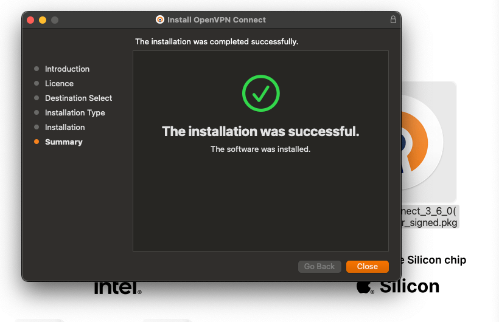
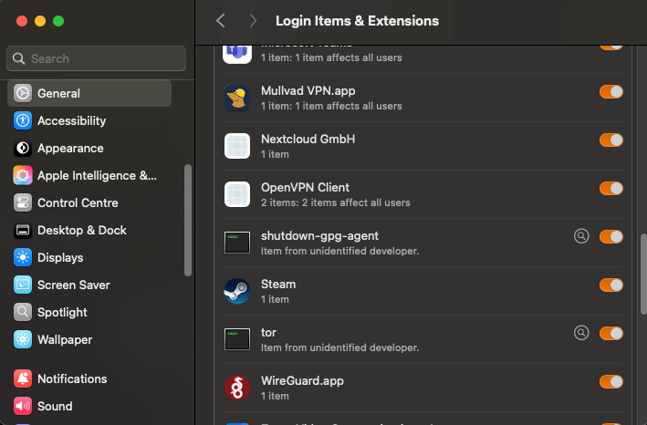
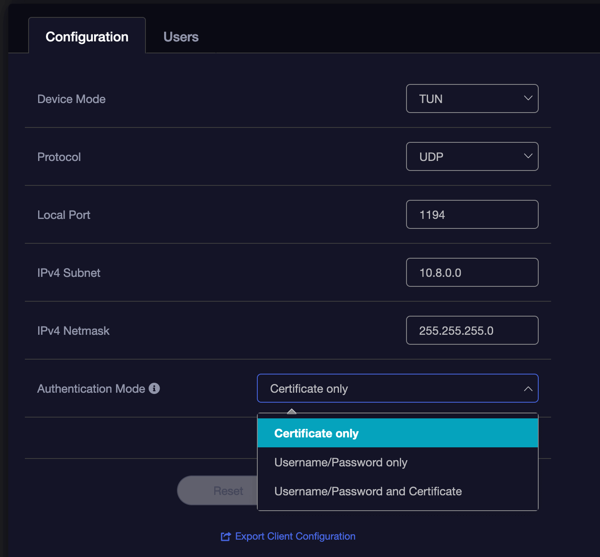
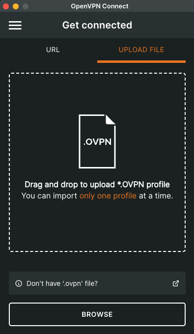
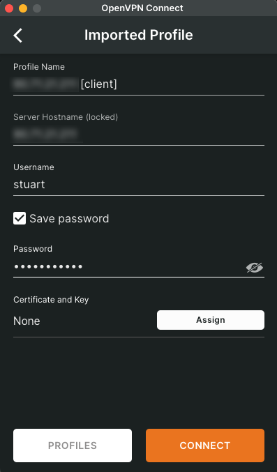
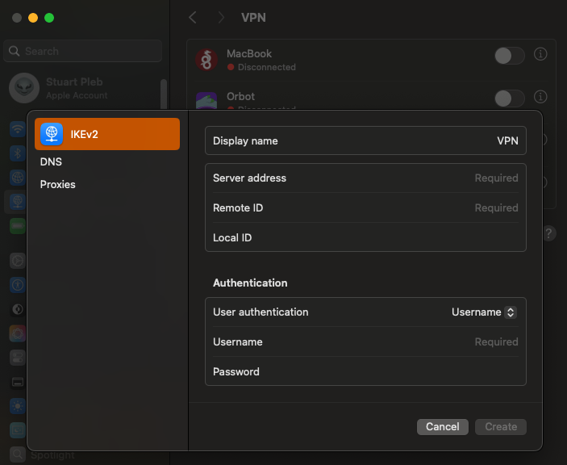

# Connecting over Router VPN (Mac)

#### Contents
- [OpenVPN](#openvpn)
- [WireGuard](#wireguard)

## Prerequisites
Most modern routers have VPN functionality built-in. You'll need to configure your router to assign a static IP to your Start9 server and to setup a OpenVPN or WireGuard server on your router, depending on which it supports.

The VPN client you set up will allow you to import your VPN configuration from your Router VPN server. You'll also use the client to easily connect and disconnect from your Router VPN server just like you would a comercial VPN app to a third-party VPN server.


## OpenVPN

Slightly slower, but with more authentication options, including creation of individual users with passwords.

1. On your Mac, install the OpenVPN Connect client downloaded from the [official website](https://openvpn.net/client-connect-vpn-for-mac-os/). 
    
    

1. If asked to do so, allow the OpenVPN client to run in the background.

    

1. Download the configuration file from your router's VPN server to your device

    

1. Import the configuration file and enter the necessary authentication settings you chose or were default on your OpenVPN Server on your router

    


1. Depending on how you've configured your OpenVPN server, you may need to add a username and password before you hit Connect.

    

1. Once set up, click on the name of the profile allows you to connect and disconnect. You can edit the profile from the icon to its right.

    


    ```admonish note

    You can avoid using the OpenVPN Connect client and create the OpenVPN connection directly in Mac OS in the VPN section of System Settings. You would select IKEv2 and add your configuration manually.

    

    ```


## WireGuard

Simpler and faster, its limitation is that it authenticates with keys rather than usernames and passwords (which might be easier to distribute to family/friends or others you share access to). You would create a WireGuard profile on your router's WireGuard Server for each device you want to connect to the VPN and follow the guide below on each device, importing the profile you created for that device.

1. On your Mac, install the WireGuard client from App Store. You'll use this to read and automatically add your VPN configuration from your Router VPN server. You'll also use it as you would a typical VPN client app to easily connect and disconnect from your Router VPN server as you would from a third-party VPN server.

    

1. Download the configuration file from your router's VPN server to your device.

    

1. Open WireGuard and create a new tunnel by importing the file downloaded to your Mac by clicking 'Import tunnel(s) from file'

    

1. Mac OS will inform you that WireGuard wants to set up a VPN connection. Click 'Allow'.

    

1. Your VPN tunnel will have been created and visible in both you Mac's system settings and conveniently in the WireGuard app where you can click to activate it.

    

    ```admonish tip

    You may need to edit your newly created tunnel and enable 'On-demand' for either ethernet, wifi or both.
    
    ```