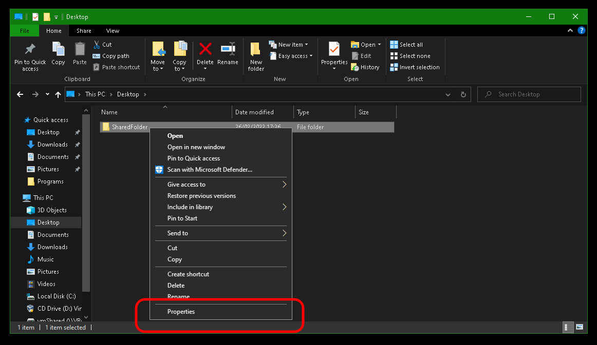
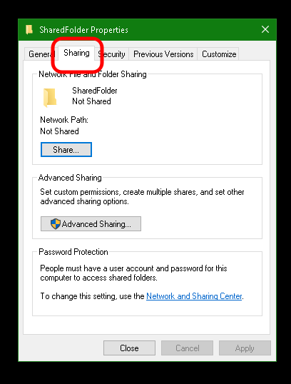
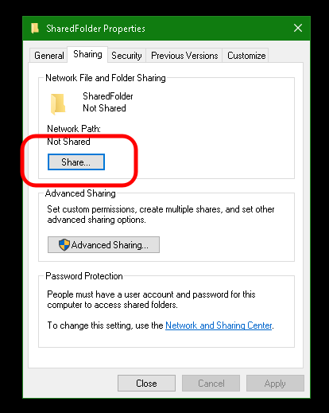
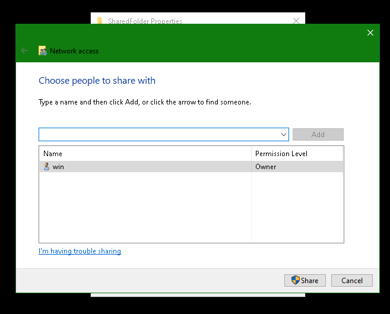
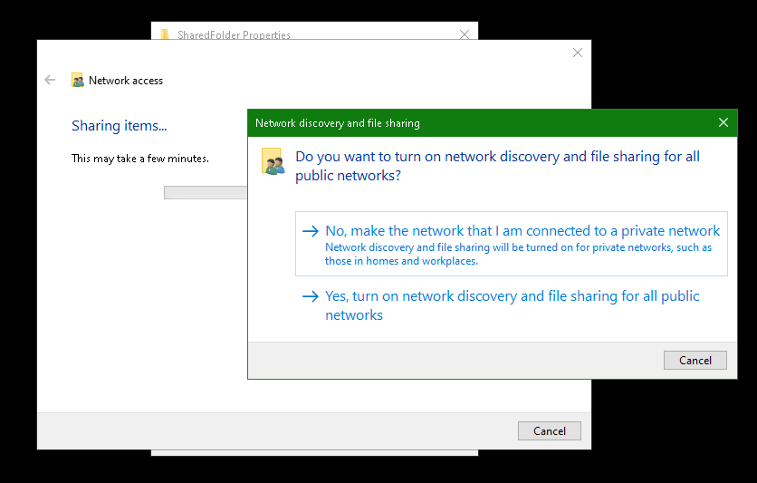
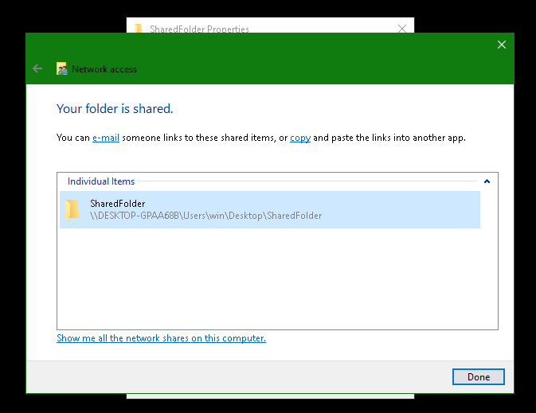

# Creating Backups (Windows)

#### Contents

1. [Create a Shared Folder](#create-a-shared-folder)
1. [Create a backup](#create-a-backup)

## Create a Shared Folder

1.  Identify or create a folder to store your server backups.

    > [!TIP]
    > This folder can be located on an external drive connected to your Windows machine.

1.  Right click the folder and click "Properties".

    

1.  Click "Sharing".

    

1.  Click "Share".

    

1.  Select a user you want to use for login and click "Share".

        

    > [!WARNING]
    > If you get the following dialog box, you have designated your network "Public". You may wish to change to "Private" if this is your home network. Otherwise you may turn on network sharing for public networks.
    > 

1.  Note the Windows directory path in grey text, highlighted in blue, beginning at the first single slash (`\`). We will use that path later.

    

## Create a Backup

1.  In StartOS, go to `System > Create Backup`.

1.  Click "Open New".

1.  Complete the form:
    1.  **Hostname**: Enter your Windows computer name (this is shown after a `\\`).

    1.  **Path** - Enter the folder path followed by the share name displayed in the Windows sharing dialog shown copied from above. In our example this would be `/Users/win/Desktop/SharedFolder`. When entering the path, make sure replace the back slashes `\` shown in Windows with forward slashes `/`.

    1.  **Username** - Your Windows user who owns the shared folder.

    1.  **Password** - Your password for the above user.

1.  Click "Connect".

    > [!WARNING]
    >
    > - If you receive `Filesystem I/O Error mount error(13): Permission denied`:
    >   1. Ensure you are entering the correct username and password. You _cannot_ use a pin.
    >   1. Ensure your windows password meets any length and complexity requirements set by your local Windows policy.
    >   1. Office365 accounts also may not work at all, try a regular user in this case.
    > - If you receive `Filesystem I/O Error mount error(115): Operation now in progress`,
    >   1. Navigate to `Start > Settings > Network & Internet > Ethernet (or WiFi)` and select the "Private" profile to treat your LAN as a trusted network that allows file sharing.
