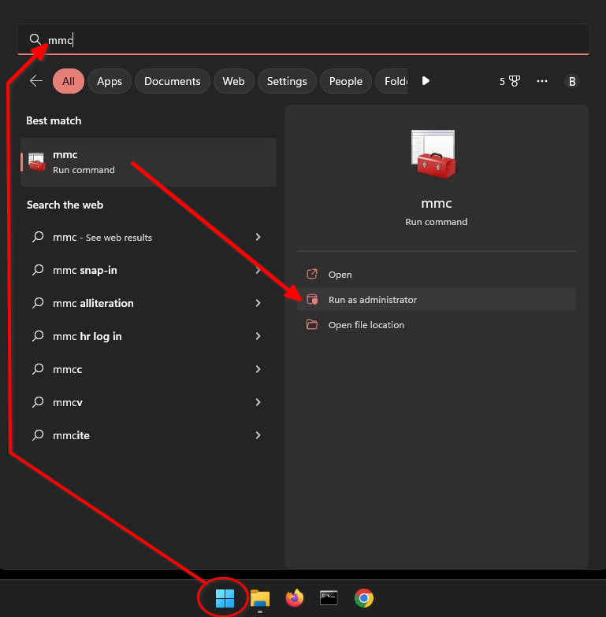
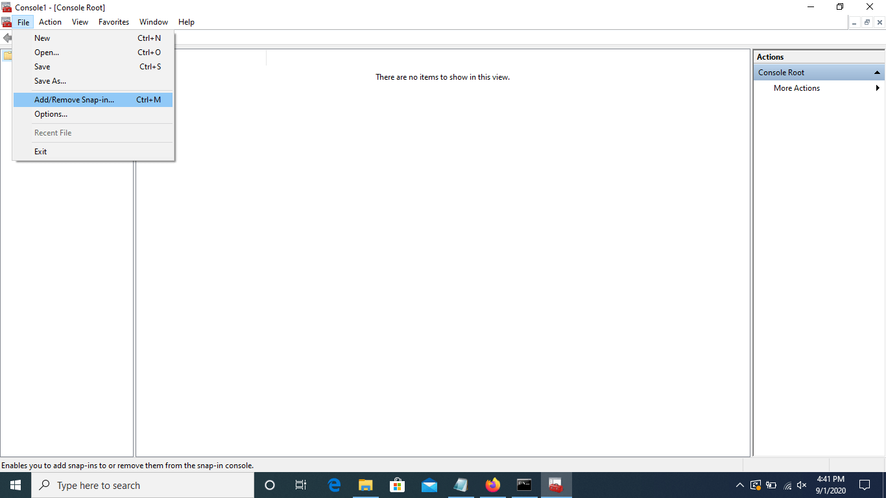
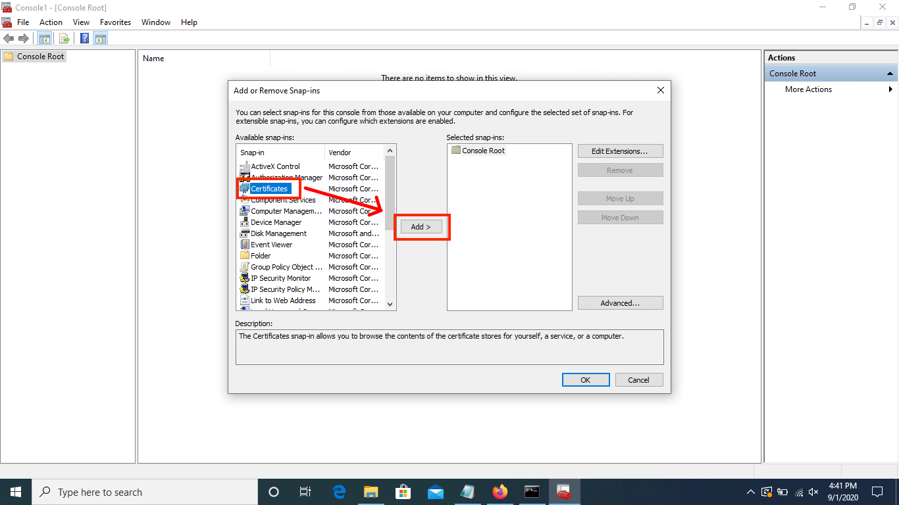
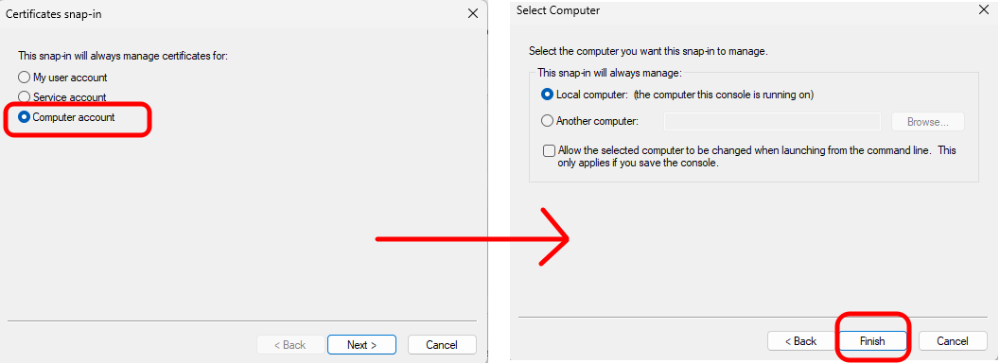
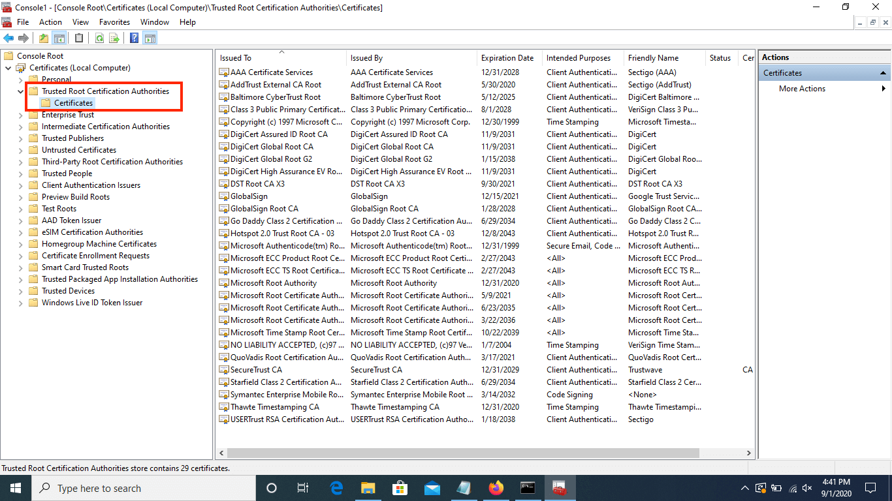
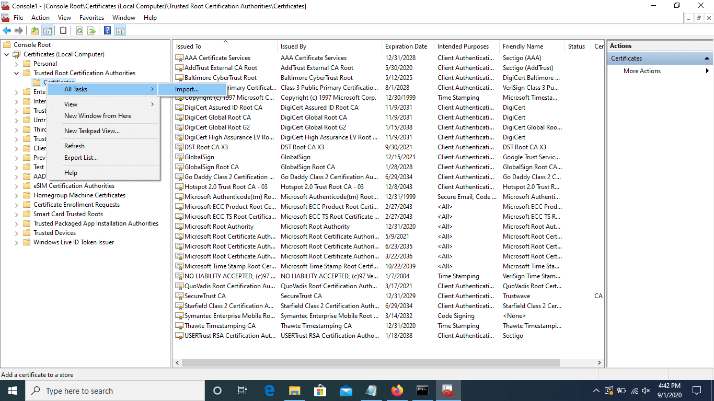
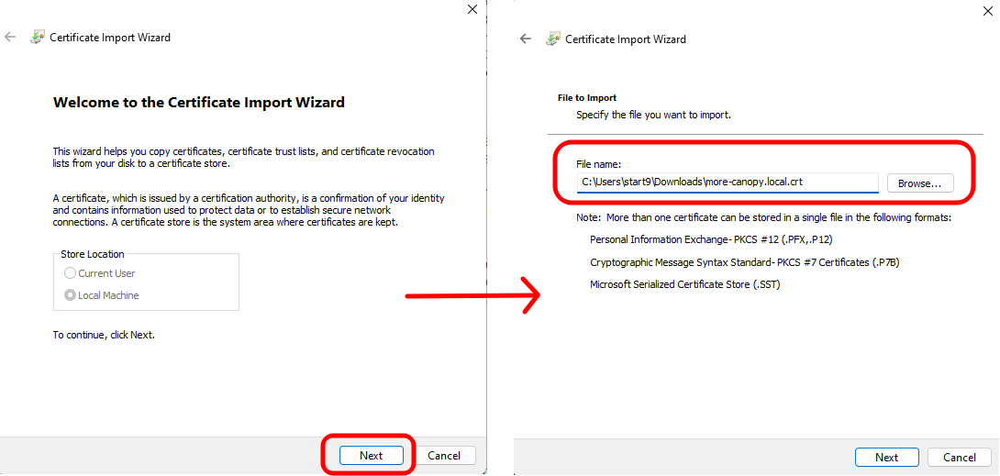
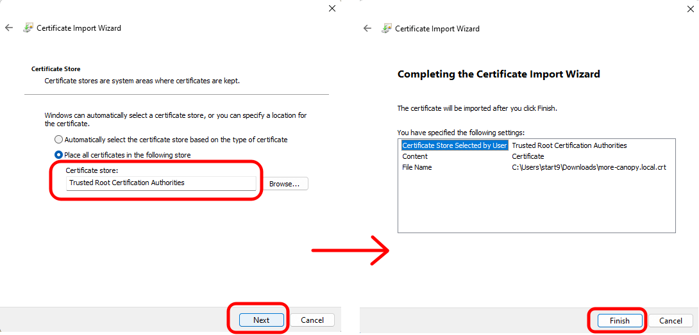
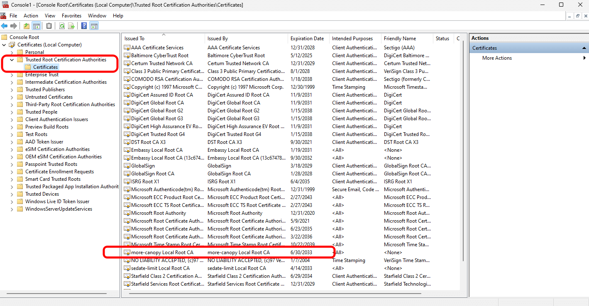

# Trusting Your Root CA (Windows)

1. Ensure you have [downloaded your Root CA](../../../user-manual/trust-ca.md#download-your-root-ca).

1. Click the "Start" menu, type `mmc`, and select "Run as administrator" to access the Windows Management Console. When prompted with the "User Account Control" window, select "Yes" to allow this program to run.

   

1. When the Management Console opens, navigate to `File > Add/Remove Snap-in`.

   

1. Select "Certificates" in the left side menu, then "Add". This will open another window.

   

1. Select "Computer account" and click "Next". Leave defaulted options on the next screen and click "Finish".

   

1. When you return to the "Add or Remove Snap-ins" page, ensure "Certificates (Local Computer)" exists under "Console Root" in the "Selected snap-ins" section, then click "OK".

   

1. In the left hand menu of the Management Console, navigate to `Certificates (Local Computer) > Trusted Root Certification Authorities > Certificates`.

   

1. Right click on the "Certificates" directory, then navigate to `All Tasks > Import`.

   

1. Click "Next" on the first page of the Certificate Import Wizard, then browse to the location where you saved the downloaded certificate and open it. Then click "Next".

   

1. On the "Certificate Store" window, ensure that it says "Trusted Root Certificate Authorities" and click "Next". Then click "Finish" on the final screen.

   

1. Select "OK" when the import is successful.

1. Verify your server's unique `<adjective-noun> Local Root CA` certificate is in the "Certificates" folder:

   

1. You can save the console settings (where we added a snap-in), if desired. Your Root CA will remain imported to the CA certificate store either way, and you will likely use this guide if you need to import a new certificate.

1. If using Firefox or Tor Browser, complete this [final step](../../misc-guides/firefox-guides/ca.md#mac--windows)
