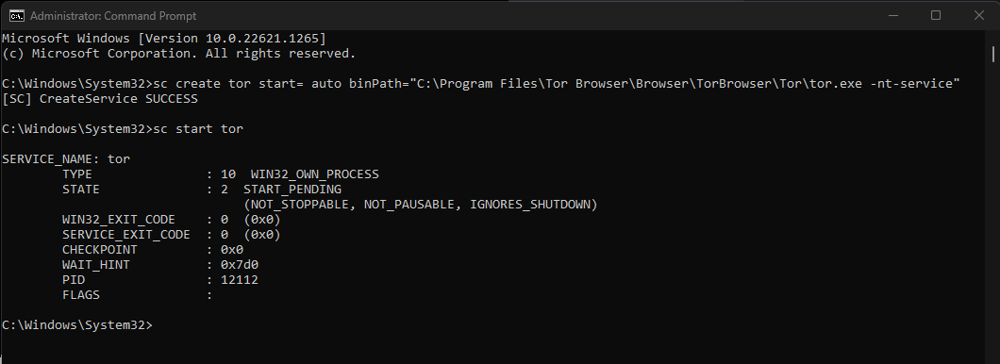

# Connecting over Tor (Windows)

1.  Unfortunately, <a href="https://torproject.org" target="_blank">Tor Project</a> no longer publishes a standalone Tor binary for Windows, so the recommended way to get it is with the Tor Browser Bundle. You can download it <a href="https://www.torproject.org/download/" target="_blank">here</a>.

1.  Once it is downloaded, run the installer by right clicking on it and selecting "Run as Administrator".

1.  Once you have selected a language, you should see a menu like this:

    

    ```admonish warning title="Change default install locaton"   
    
    We will install it to `C:\Program Files\Tor Browser`. 
    If you choose a different folder, it needs to _not_ be anywhere under `C:\Users\`. Note the path you use here for the step after next.
    ```

1.  Open your Command Prompt as an administrator. In Windows 10, you can simply type `cmd` in the Windows search bar. Right click on the first result, and select "Run as Administrator".

1.  Configure Tor to run perpetually in the background. Insert your destination folder (from above) between `binPath="` and the `Browser` subfolder

        sc create tor start= auto binPath="C:\Program Files\Tor Browser\Browser\TorBrowser\Tor\tor.exe -nt-service"

    ```admonish warning title="Troubleshooting"

    If you receive `Access denied`

    1. ensure you are running the command prompt in Administrator Mode. You can tell because the prompt will show C:\\Users\\YOUR-USERNAME> if you are _not_ in admin mode, and it will show C:\\WINDOWS\\system32 if you ARE in admin mode.
    ```

1.  Start Tor.

        sc start tor

    

    ```admonish warning title="Troubleshooting"

    If you receive `The specified service already exists`:

    1. Run the command:

            sc delete tor

    1. Uninstall the Tor Browser, following <a href="https://tb-manual.torproject.org/uninstalling/" target="_blank">these steps</a>.

    1. Begin this guide again from the beginning.
    ```

1. If using Firefox or Tor Browser, complete this [final step](../../misc-guides/firefox-guides/ca.md#mac--windows)