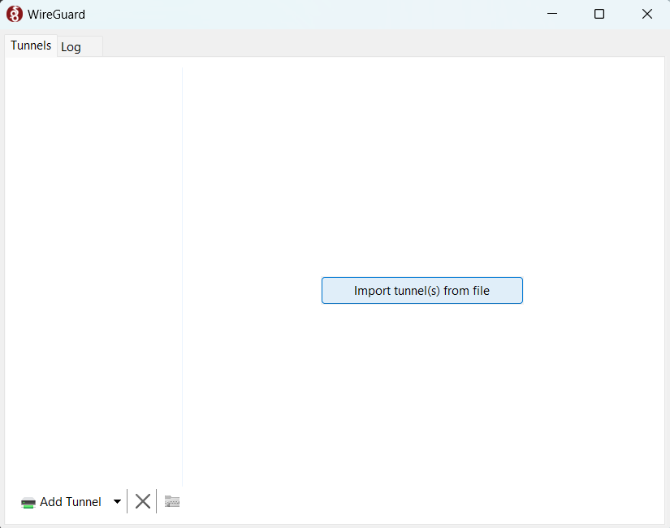
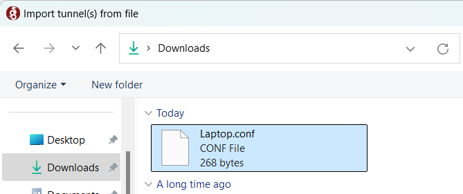
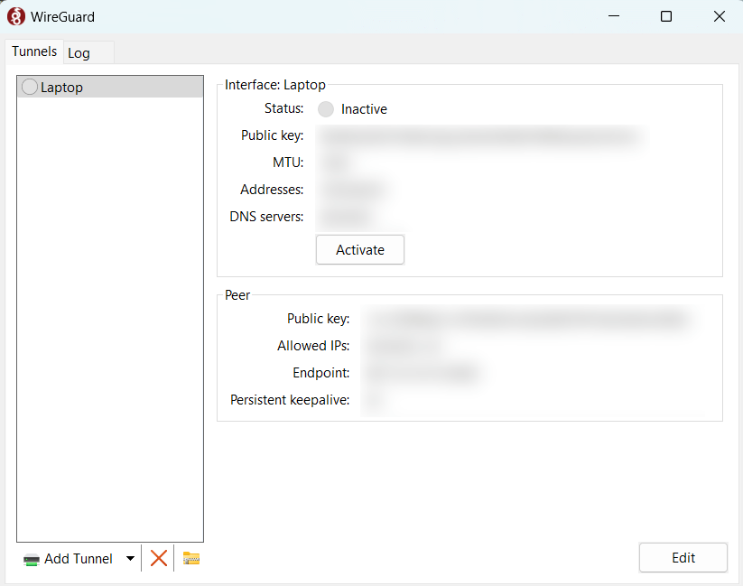
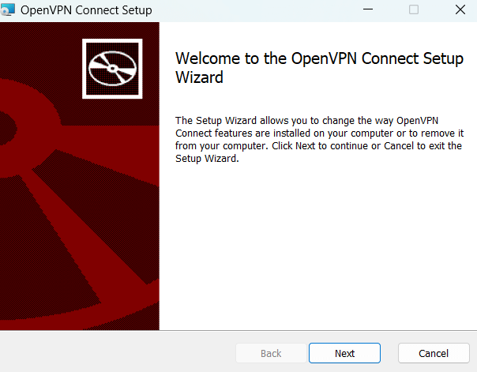
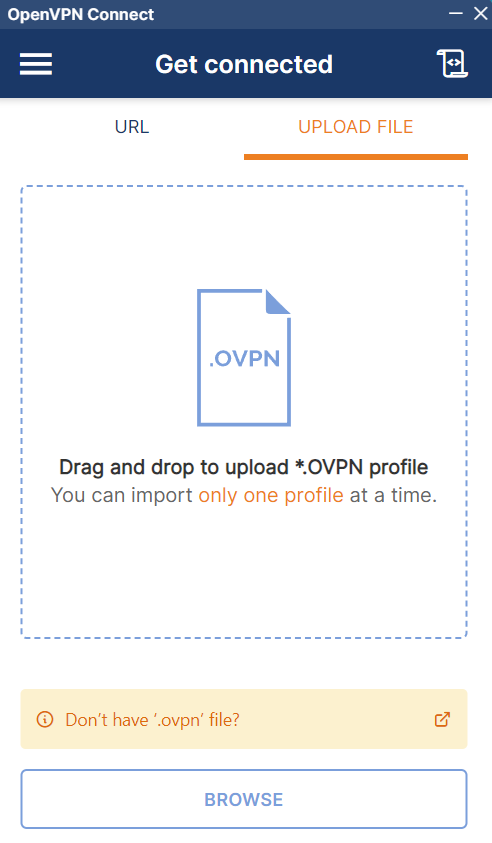
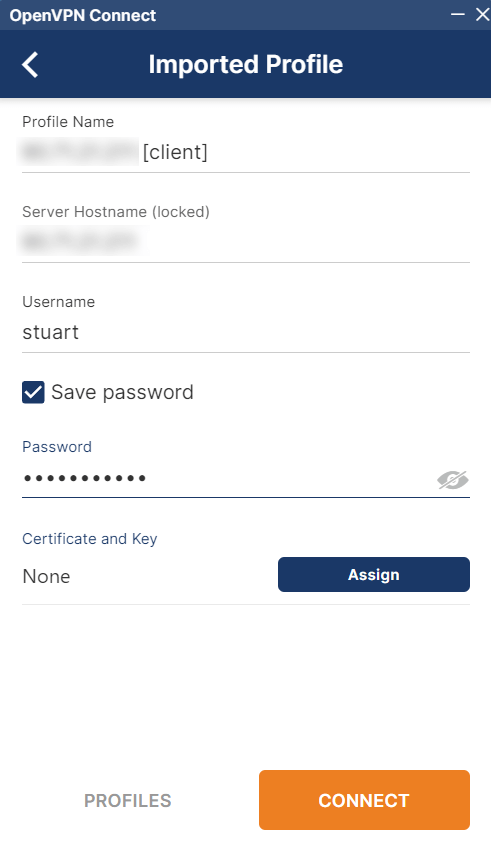

# Connecting via VPN (Windows)

Follow this guide to privately access your server from your Windows device using a VPN.

#### Prerequisites

- [Connecting Remotely - VPN](../../user-manual/connecting-remotely/vpn.md)

#### Contents

- [WireGuard](#wireguard)
- [OpenVPN](#openvpn)

## WireGuard

1. Obtain a WireGuard config file for your device.

   - **StartTunnel**: Follow instructions [here](../../misc-guides/start-tunnel.md#adding-a-client-device-for-private-access)
   - **Router**: Follow your router's instructions.

1. Install WireGuard from the [official website](https://www.wireguard.com/install/).

1. Click "Import tunnel(s) from file" and select the file you downloaded above.

   

   

1. Your VPN tunnel will have been created and visible conveniently in the WireGuard app where you can click to activate it via the 'Activate' button.

   

## OpenVPN

1. OpenVPN Connect from the [official website](https://openvpn.net/client/client-connect-vpn-for-windows/).

   

1. Download the configuration file from your router's OpenVPN server.

   

1. Import the configuration file and enter the necessary authentication settings you chose or were default on your OpenVPN Server on your router

   

1. Depending on how you've configured your OpenVPN server, you may need to add a username and password before you hit Connect.

   

1. Once set up, click on the name of the profile allows you to connect and disconnect. You can edit the profile from the icon to its right.

   
