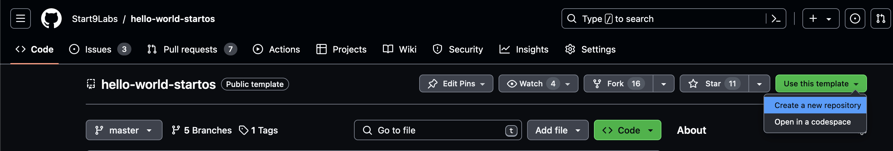

# Quick Start

## Environment Setup

Ensure you have completed every step of [environment setup](./environment-setup.md).

## Generate your Package Repository

1. Select a template:

   - Use <a href="https://github.com/Start9Labs/hello-world-startos" target="_blank">Hello World</a> if your service does _not_ depend on another service.
   - Use <a href="https://github.com/Start9Labs/hello-moon-startos" target="_blank">Hello Moon</a> if your service depends on at least one other service.

1. Click `Use this template > Create new repository`. You must be signed into Github to see this button.

   

1. Name your repository. The name should be `[service-name]-startos`. For example, NextCloud is `nextcloud-startos` and Lightning Terminal is `lightning-terminal-startos`.

1. For the repository description, enter "StartOS package for [Service Name]".

1. Make sure the repository is Public.

1. Click "Create Repository".

## Clone your Package Repository

From the command line of your local work machine, run the following commands:

```
git clone [your-repository-url]
```

```
cd [repository-name]
```

```
npm i
```

## Build the s9pk

    make

## Install the s9pk

### From the CLI

```
start-cli install -h <host> -s <path-to-s9pk>
```

You can eliminate the `-h` argument by hard-coding the host in `~/.startos/config.yaml`.

### From the GUI

From the GUI of your StartOS server, go to `System > Sideload`, upload the .s9pk file, and click "Install".
