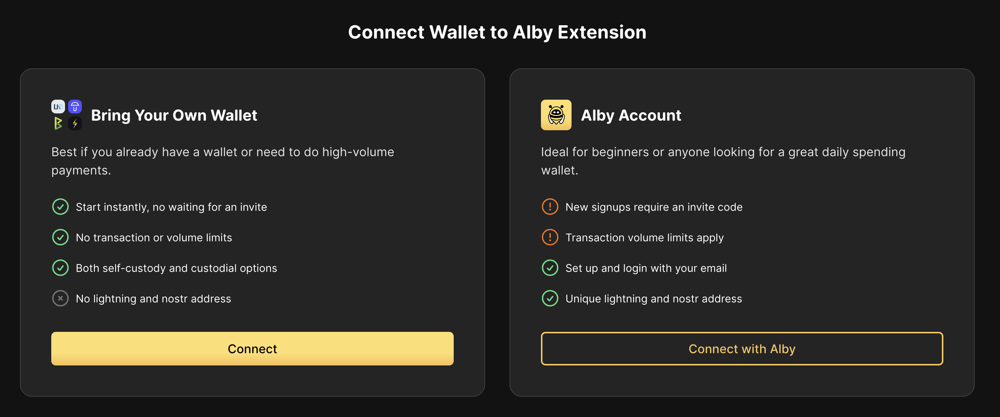
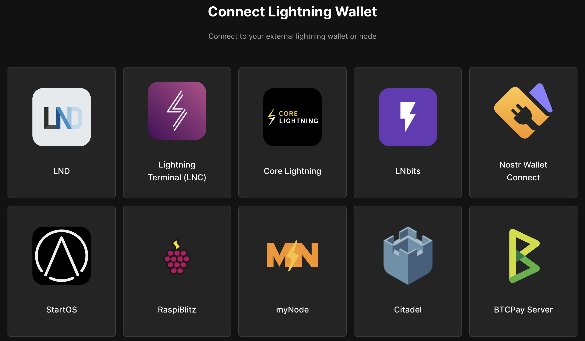

# Core Lightning - Alby Browser Extension

Alby is a browser extension that can be connected to your lightning node a number of ways. This guide will go over direct connections between Alby and your **Core Lightning** node.

> [!WARNING]
> If you are looking for Alby Hub, this is not it. To use [Alby Hub](../lnd/alby-hub.md) you must instead run [LND](../lnd/).
> This is NOT the guide for setting up **Alby Hub** this is for a direct connection to LND. If you'd like to connect via Alby Hub instead (recommended), click [here].

If you'd like to connect via [LNbits](https://marketplace.start9.com/marketplace/lnbits) which allows allocation of funds, please see [this guide](../lnbits.md).

> [!NOTE]
> We are going to connect using Tor so that Alby will be able to connect from anywhere.

1. Make sure you are already [running Tor](/user-manual/connecting-remotely/tor.md) on your system and we suggest using Firefox which must be [configured to use Tor](/misc-guides/firefox-guides/tor.md)

1. Download the Alby extension by visiting the [Alby Github](https://github.com/getAlby/lightning-browser-extension#installation), selecting your browser, and installing.

1. On the Alby welcome screen, select **Get Started**.

1. Create a strong password and store it somewhere safe, like your Vaultwarden password manager.

1. On the next screen, select **Bring Your Own Wallet** and click **Connect**.

   

1. Click **Start9** first...

   

1. ... and only then **Core Lightning**.

   

1. You will see the following fields to fill out:

   

1. For "Host" this is your Peer Interface - find this under **Interfaces -> Machine Interfaces** within the CLN service on your Start9 server. Copy the address shown here but **remove the http://** at the start and paste it into **Host** within Alby:

1. For **Public key** enter your **Node Id** found at the top of **Properties** within the CLN service on your server.

1. To generate a rune on StartOS you will need to navigate to Core Lightning > Actions > Generate Rune. Then copy the value and paste it into Alby.

1. Leave the **Port** as 9735.

1. Click **Continue**. Once the connection is completed you will see a success page that displays the balance of your CLN node in Sats.

   

Alby is now connected to your CLN node over Tor!
