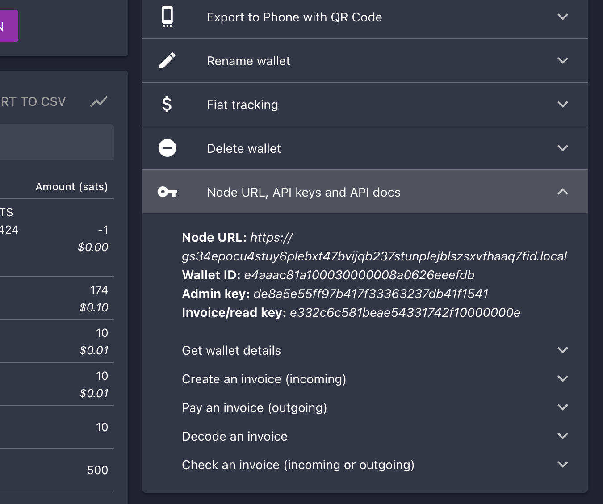
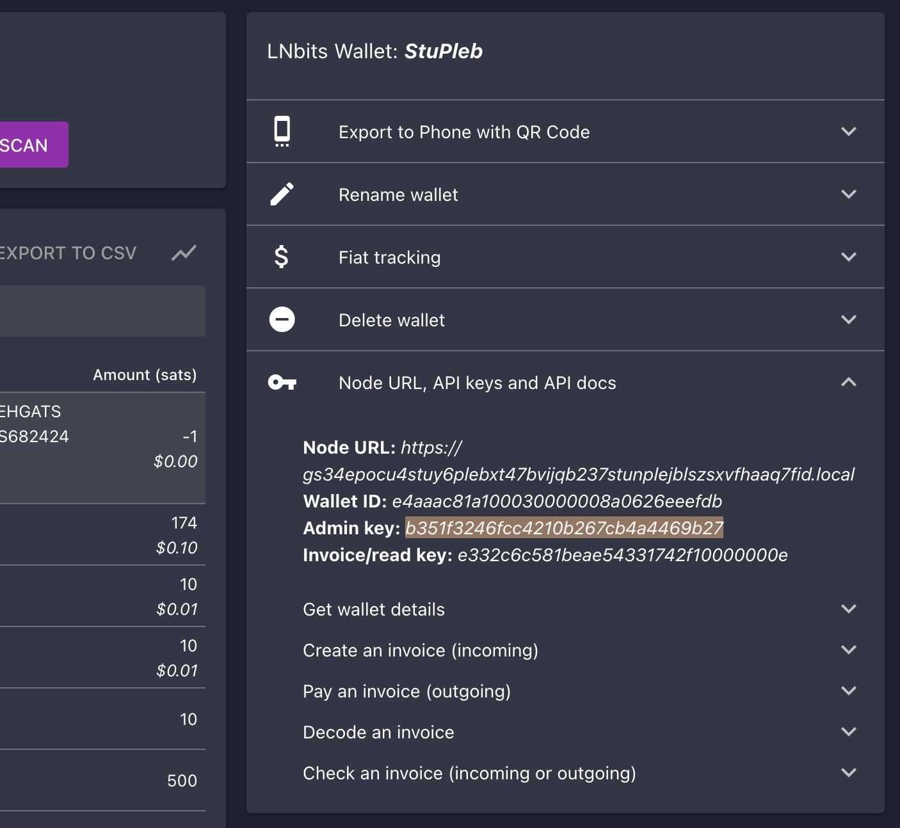

# Alby Browser Extension with LNbits

Alby is a browser extension that can be connected to your lightning node a number of ways. This guide will go over connecting Alby to your **LNbits wallet** which allows allocation of funds.

If you'd like to connect to LND or CLN directly with Alby, [start here](../README.md).

```admonish note

This guide assumes you have already setup LNbits as per [this guide](../lnbits.md).

```

1. Make sure you are already [running Tor](/user-manual/connecting-remotely/tor.md) on your system and we suggest using Firefox which must be [configured to use Tor](/misc-guides/firefox-guides/tor.md)

1. Download the Alby extension by visiting the [Alby Github](https://github.com/getAlby/lightning-browser-extension#installation), selecting your browser, and installing.

1. On the Alby welcome screen, select **Get Started**.

1. Create a strong password and store it somewhere safe, like your Vaultwarden password manager.

1. On the next screen, select **Bring Your Own Wallet** and click **Connect**.

   

1. Click **Start9** first...

   

1. ... and only then **LNbits**.

   

1. You will see the following fields to fill out:

   

1. Head back to LNbits and select the wallet you created then click on the arrow to the right of **API Info**:

   

1. Copy the **Admin key** and paste it into Alby

1. Head back to your Start9 server’s LNbits service page and select Interfaces:

   

1. Copy the **Tor Address**:

1. Head back to Alby and paste what you just copied into **LNbits URL**, select **Tor (native)** then hit **Continue**:

   

1. Click **Continue**. Once the connection is completed you will see a success page that displays the balance of your CLN node in Sats.

```admonish tip

Make sure to include the http:// at the start of the address. If it is not working make sure that you are properly [configured Tor](/user-manual/connecting-remotely/tor.md) on your system.

```

1. Once connected you should see the following success page:

   

   Alby is now connected to your lightning node via LNbits!

1. In addition to allocating sats to this wallet via the LNbits Superuser Account (see “Funding LNbits section” [here](../lnbits.md#funding-lnbits)), you can also receive funds the normal way by hitting Receive within Alby.

```admonish note

Funds received this way must be sent from another lightning node, not the node underneath LNbits. A lightning payment that originates and terminates at the same node is technically a rebalance, not a normal payment.

```

You’re now setup with Alby and LNbits!
