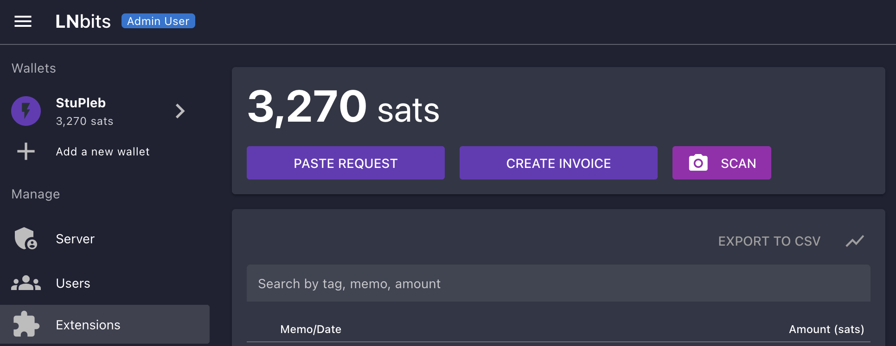

# BlueWallet  with LNbits

```admonish note

This guide assumes you have already setup LNbits as per :ref:`this guide <connecting-lnbits>` with **LND** as your underlying node.

```

```admonish warning

**This will not work with CLN as your underlying node!**

```

1. Bluewallet requires that we use the LnbHub extension in order to connect to LNbits.

1. To do this, click **Manage Extensions**:

    

1. Click **MANAGE** under the LndHub extension:

    

1. Click the two arrows on the right, then click install:

    

1. Now ensure that it says **Activated** underneath LndHub and then click **Extensions** on the left:

    

1. Click **ENABLE**:

    

1. Click **OPEN** *or* **LndHub** under *Extensions*:

    

1. Make sure the wallet you just created is selected below the two QR codes:

    

1. Open up BlueWallet and click on the three dots in the top right:

    

1. Click "Network" then "Tor settings":

    

    

1. Click "Start" and it should say "Done" after a short time:

    

    

1. Head back to the main screen and click the **"+"** sign:

    

1. Click "Import wallet":

    

1. Click "Scan or import a file"

1. *If you only want this wallet to be able to RECEIVE PAYMENTS, scan this QR code:*

    

    *If you are happy for this wallet to be able to both receive and MAKE payments scan this QR code:*

    

1. You'll see this once the wallet is added:

    

1. In addition to allocating sats to this wallet via the LNbits Superuser Account (see "Funding LNbits section" [here](../lnbits.md#funding-lnbits)), you can also receive funds the normal way by hitting "Receive" within BlueWallet.


```admonish note

Funds received this way must be sent from another lightning node, not the LND node underneath LNbits. A lightning payment that originates and terminates at the same node is technically a rebalance, not a normal payment.

```

Congratulations! BlueWallet is set up and ready to use lightning via your own lightning node - furthermore it will only be able to use your node in the way you allow it, via LNbits.