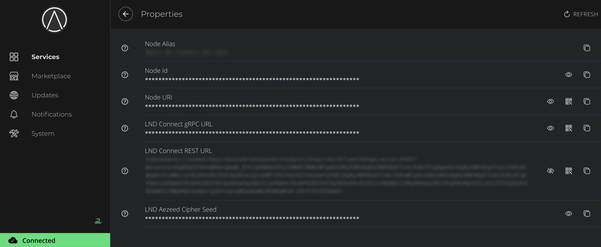

# LND - Alby Browser Extension

Alby is a browser extension that can be connected to your lightning node a number of ways. This guide will go over direct connections between Alby and your **LND** node. 

If you'd like to connect via [LNbits](https://marketplace.start9.com/marketplace/lnbits) which allows allocation of funds, please see [this guide](../lnbits.md).

```admonish note

We are going to connect using Tor so that Alby will be able to connect from anywhere.

```

1. Make sure you are already [running Tor](/user-manual/connecting-remotely.md) on your system and we suggest using Firefox which must be [configured to use Tor](/user-manual/connecting-remotely.md#running-tor-in-the-background-on-your-phonelaptop)

1. Download the Alby extension by visiting the [Alby Github](https://github.com/getAlby/lightning-browser-extension#installation), selecting your browser, and installing.

1. On the Alby welcome screen, select **Get Started**.

1. Create a strong password and store it somewhere safe, like your Vaultwarden password manager.

1. On the next screen, select **Bring Your Own Wallet** and click **Connect**.

    

1. Click **Start9** first...

    

1. ... and only then **LND**.

    


1. Copy the LND Connect REST URL from your LND service page’s Properties section and paste it into Alby:

    

    

1. Alby will pick up that you are connecting over Tor and suggest using their Companion App (only needed if your browser isn’t setup to use Tor) or using Tor natively which you will be able to do. Select **TOR (native)** and click **Continue**:

```admonish note

If this does not work, please ensure that Tor is running on your system and that Firefox is configured to use it. If you can’t get this to work it’s OK to use the Companion App - but you will have a better experience with your Start9 server elsewhere if you take the time to get Tor running on your devices.

```

1. Once connection is completed you will see a success page that displays the balance of your LND node in Sats.. 

    

Alby is now connected to your LND node over Tor!
