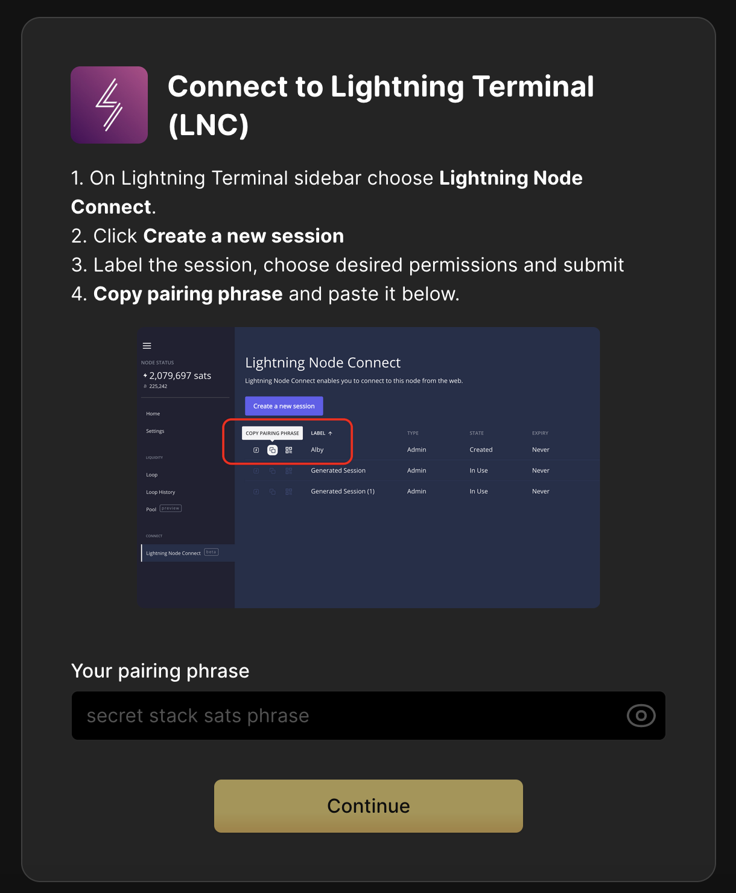

# LND via Lightning Node Connect (LNC) - Alby

Alby is a browser extension that can be connected to your lightning node a number of ways. This guide will go over connecting **Alby and LND** using **LNC**. 

If you'd like to connect **directly** using LND's REST API see [here](./alby.md). If you'd like to connect via [LNbits](https://marketplace.start9.com/marketplace/lnbits) which allows allocation of funds, please see [this guide](../lnbits.md).


```admonish note

This requires installing the [Lightning Terminal](https://marketplace.start9.com/marketplace/lightning-terminal) service from the marketplace.

```

1. Download the Alby extension by visiting the [Alby Github](https://github.com/getAlby/lightning-browser-extension#installation), selecting your browser, and installing.

1. Install [Lightning Terminal](https://marketplace.start9.com/marketplace/lightning-terminal) from the marketplace.

1. On the Alby welcome screen, select **Get Started**.

1. Create a strong password and store it somewhere safe, like your Vaultwarden password manager.

1. On the next screen, select **Bring Your Own Wallet** and click **Connect**.

    

1. Click **Start9** first...

    

1. ... and only then **Lightning Terminal (LNC)**.

    


1. You will see the following screen. Launch the Lightning Terminal service UI from your Start9 server and do as instructed below:

    

1. Click **Continue** and you will see this once you successfully connect:

    

Alby is now connected to your LND node via LNC!
