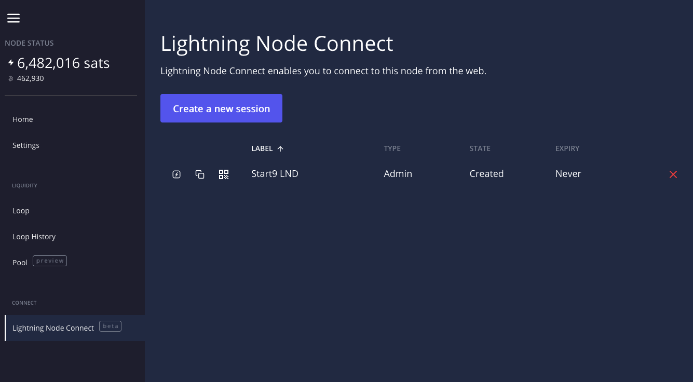

# LND via Lightning Node Connect (LNC) - Zeus

Zeus is a powerful mobile wallet that can be connected directly to LND and or avoiding Tor via LNC. This guide will go over connecting **Alby and LND** using **LNC**.

Available For:

- Android
- iOS

If you'd like to connect **directly** using LND's REST API see [here](./zeus.md). If you'd like to connect via [LNbits](https://marketplace.start9.com/marketplace/lnbits) which allows allocation of funds, please see [this guide](../lnbits.md).

> [!NOTE]
> This requires installing the [Lightning Terminal](https://marketplace.start9.com/marketplace/lightning-terminal) service from the marketplace.

1. Download [Zeus](https://zeusln.app/) for your device.

1. Install [Lightning Terminal](https://marketplace.start9.com/marketplace/lightning-terminal) from the marketplace.

1. Log into StartOS and select Services -> Lightning Terminal and click Launch UI. The password can be found in Services -> Lightning Terminal -> Properties.

1. From the Lightning Terminal interface, click **Lightning Node Connect**.

1. Click to **Create a new session**.

1. Name the wallet and click **Submit**.

   

1. Click on the QR code:

   

1. Open up Zeus and click **SCAN NODE CONFIG** then scan the QR code.

1. Tap **SAVE NODE CONFIG**.

> [!TIP]
> If you already have other nodes configured in Zeus, go to Settings.-> Connect a node -> + . Then scan the QR code, and tap "Save node config".

That's it. You can now use your LND Node via LNC with Zeus.
