# Opening Channels

Here we'll show you how to install a lightning node and how to open a channel with Start9!  We recommend first taking a moment to [understand the important concept of liquidity](https://bitcoin.design/guide/how-it-works/liquidity/).

## Running a Node and Making a Channel with Start9

1. First, ensure that you have Bitcoin Core installed, running, and fully synced.

1. Install a lightning node. There are two options we offer on the [Start9 marketplace](https://marketplace.start9.com) - LND and Core Lightning. In this guide we're going to use Core Lightning (CLN). Though you can use LND and the process will be almost exactly the same.

1. Read through and then follow either the [LND Guide](https://github.com/Start9Labs/lnd-startos/docs/introduction.md) or the [CLN Guide](https://github.com/Start9Labs/cln-startos/docs/introduction.md) to end up with a lightning node ready to use.

1. **Start** and wait for CLN to sync up to the network. This may take a couple of minutes or a couple of hours. Once the **Synced** health check turns green (as below) you can proceed to the next step.

1. To interact with your node we will use [Ride The Lightning (RTL)](./#ride-the-lightning-rtl) - this is a service that provides a graphical user interface for our lightning node. This will work with either (or both!) lightning implementations.

1. Install it and click on **Configure** just like with CLN.

    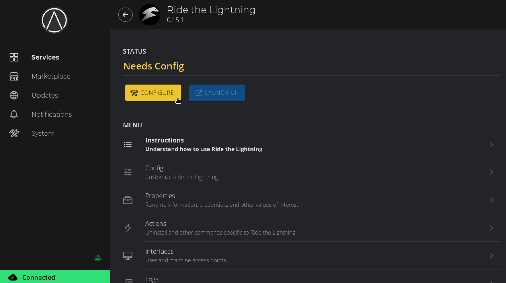

1. It will default to LND. In this case we are using a CLN node instead, so we will change the default setting as shown:

    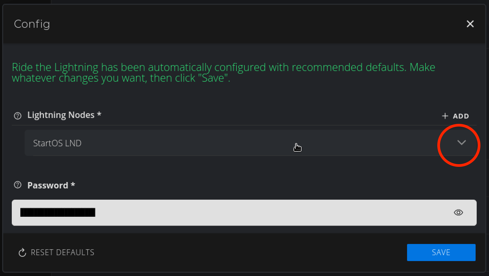


    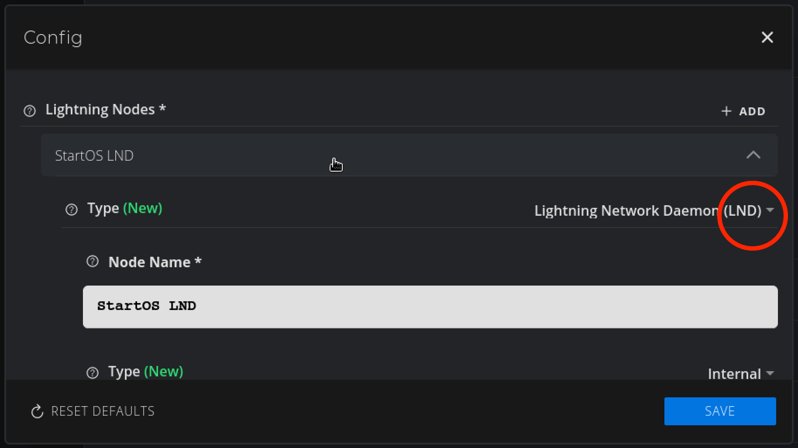

   Change to Core Lightning (CLN) and hit OK:

    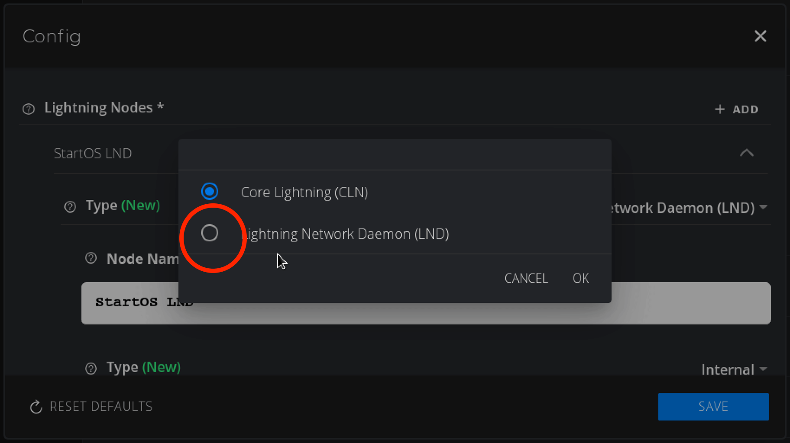

   Hit **Save**:

    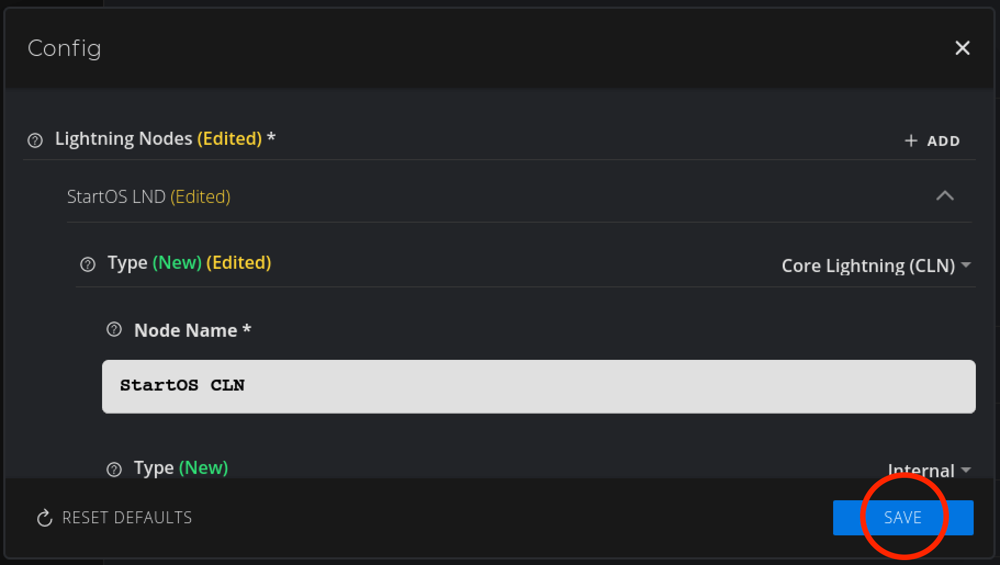

1. Now hit **Start**:

1. With RTL started, click **Properties**:

1. Copy the automatically generated password:

    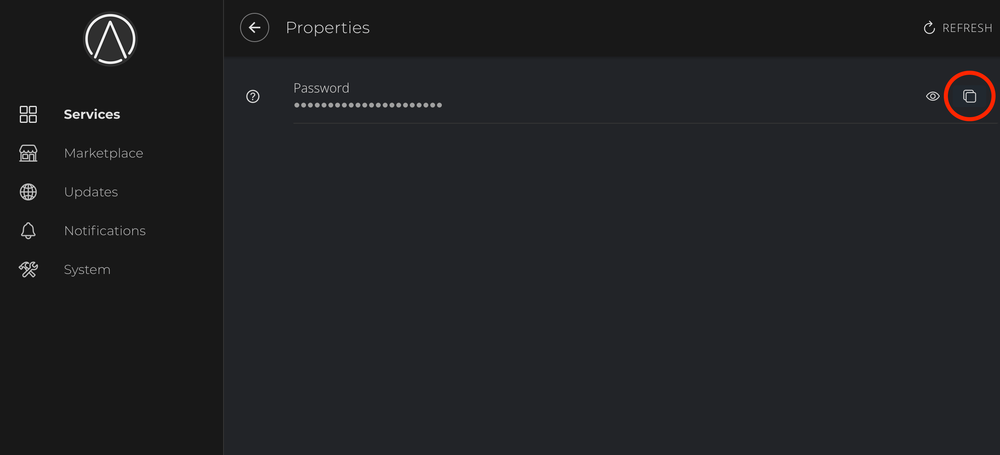

1. Head back to the RTL service and click **Launch UI**:

    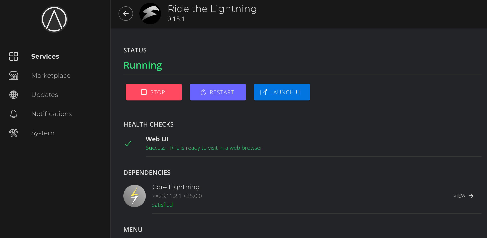

   Enter the copied password and log in:

    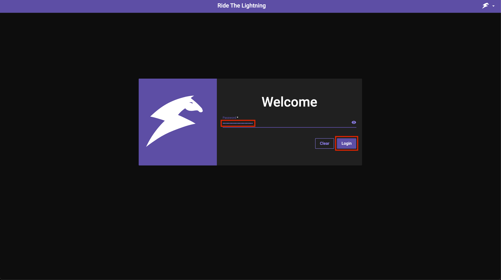


    ```admonish tip

    You can add the password to your password manager for convenience.

    ```


1. Once in RTL, click **On-chain** then click **Generate Address**:

    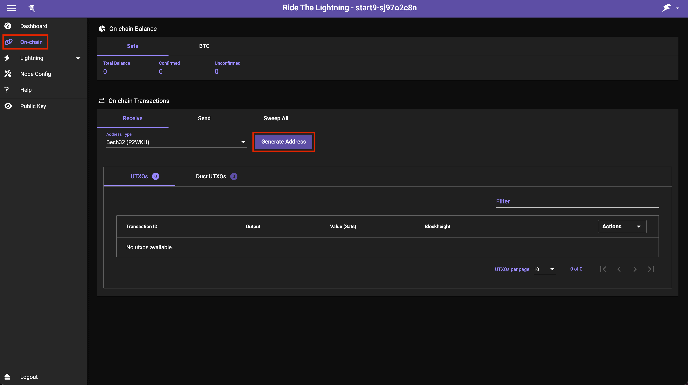

1. Send bitcoin to the generated address to add funds to your lightning wallet:

    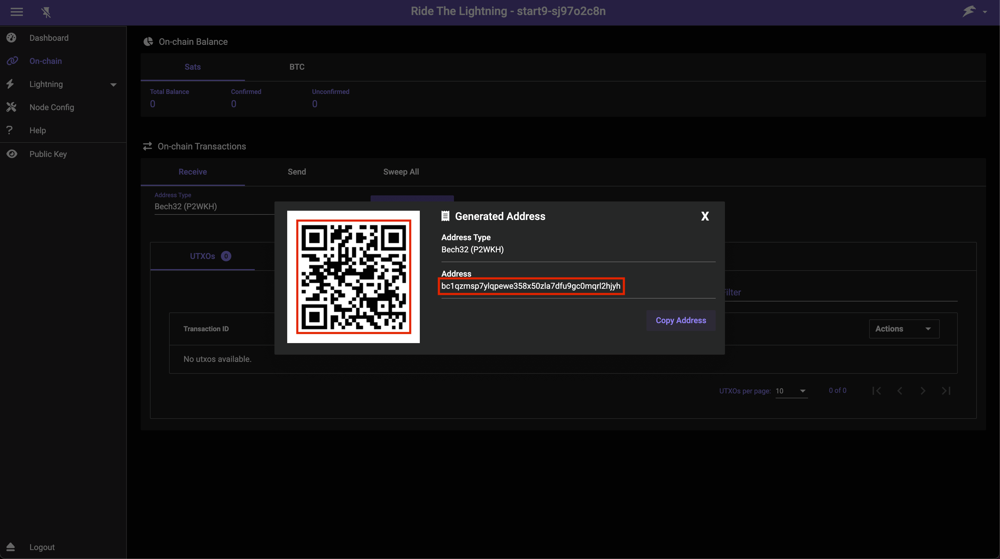

   ```admonish warning

    Please do not send money to the address pictured above as we will not receive it. If you are intent on sending us money please [head here](https://donate.start9.com).

    ```

1. Once your sats confirm on-chain you'll see this:

    

1. Now we must add a peer with which to make channels. In this example we will be opening a channel with Start9 so we will add Start9's node as a peer. Click **Peers/Channels**:

    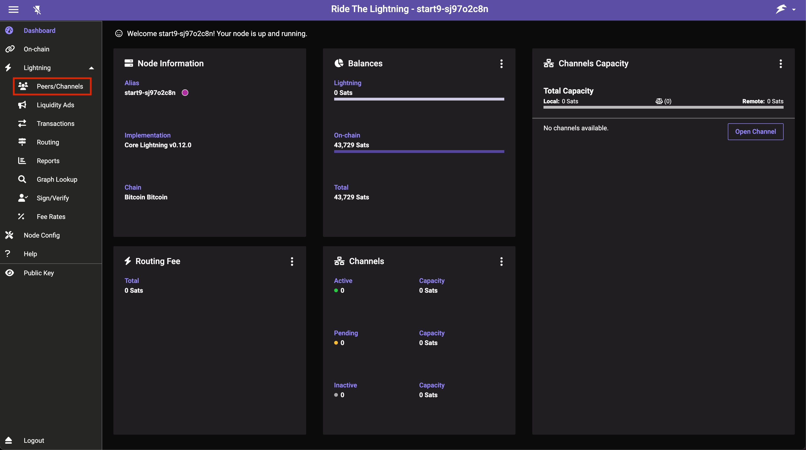

1. Click **Peers** then **Add Peer**:

    

1. Enter the details of the lightning node you'd like to open a channel with. Start9's node can be found [here](https://amboss.space/node/025d28dc4c4f5ce4194c31c3109129cd741fafc1ff2f6ea53f97de2f58877b2295) and is what we'll use in this example. You can use another node if you like - ideally one that is well connected. Once chosen and added as below, click **Add Peer**:

    

   ```admonish note

    The syntax is as follows **NodePublicKey@ipaddress:port** - If it's a Tor node it will be **PublicKey.onion:port** instead.

    ```

1. Then you can enter an amount (the size of the channel), select Private Channel (unless you want a public channel - see below), and a Fee Rate (check a [block explorer](https://mempool.space) for an idea of current necessary fees):

    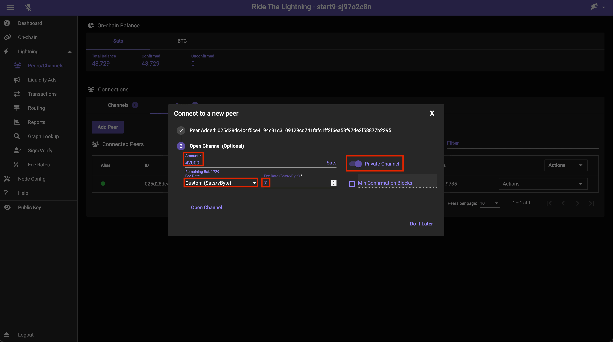

   ```admonish note

    Here we are creating a very small channel with a capacity for payments of only a few dollars. You will likely want your channel to be larger than this so that it's actually usable for reasonably sized payments. Channels this small may well get closed by the remote peer.

    ```

   ```admonish note

    Using a private channel is what we advise as a default. You may wish for the channel to be public if you intend on becoming a routing node or for other reasons.

    ```


1. You will now see your channel in **Channels** -> **Pending/Inactive**:

    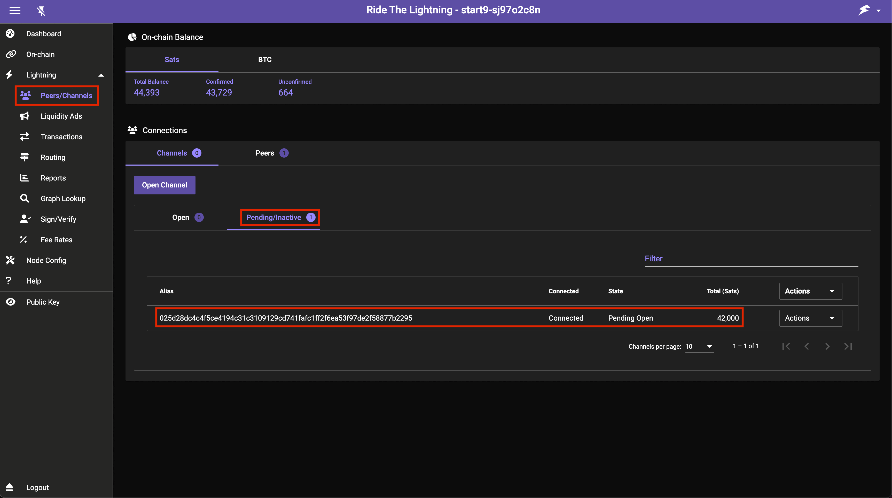

1. Once the transaction opening the channel gets added to a block your channel will soon appear here under **Open**:

    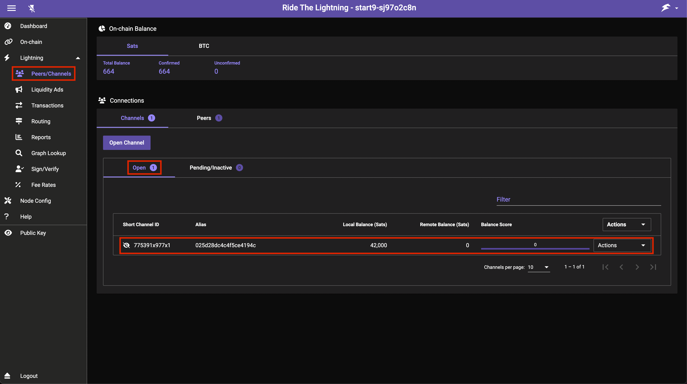

1. To make a payment head to the **Transactions** tab and press **Send Payment**:

    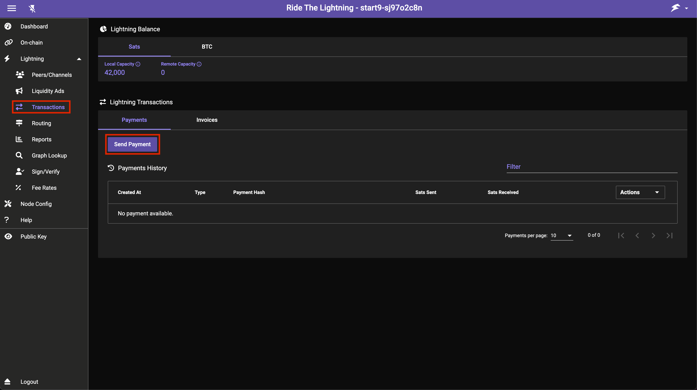

1. That's it! You now have a lightning node running with a channel open ready to send payments on the lightning network!

   ```admonish note

    You will not be able to receive payments until you have inbound liquidity in your channel. After completing the above process you will only have outbound liquidity. Inbound liquidity can be created by making payments, having someone open a channel to you or via more sophisticated channel creation.

    [This guide](getting-inbound-liquidity.md) will explain more about attaining inbound liquidity.

    ```

If you want to connect other applications or wallets to your node, please see the guides [here](./#connecting-to-cln).