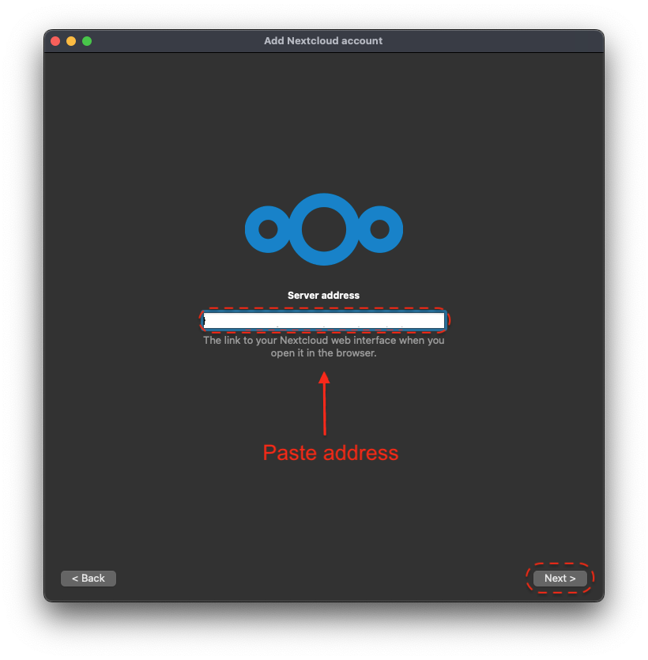
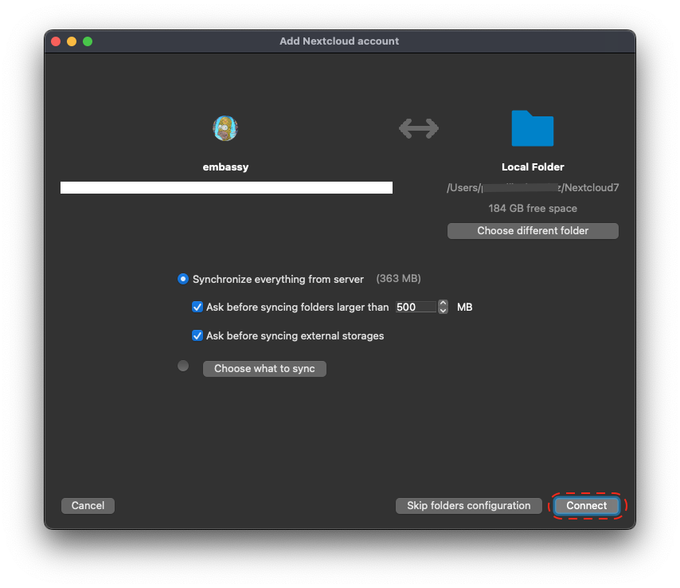
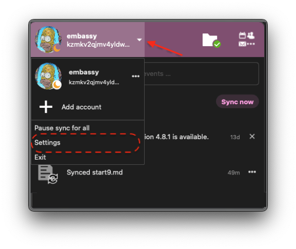

# Nextcloud - Mac OS

## Initial Config

For the best experience, it is recommended to set up your Nextcloud devices on [LAN](/user-manual/connecting-locally.md) with a designated IP address and port. This setup allows you to sync files, calendars, and contacts while away from home using a [Router VPN](/user-manual/connecting-remotely/vpn.md).

Once configured, you can also use Tor for remote syncing. However, keep in mind that transferring large files may fail or take a considerable amount of time. Therefore, it is advisable to use remote syncing primarily for low-bandwidth activities, such as syncing calendars, contacts, tasks, and notes. Streaming music is also possible.

```admonish warning

When using remote connections, be mindful of any data caps on your cellular plan. You may need to limit bandwidth usage by disconnecting from your Router VPN server or Tor when using cellular data.

```

## Native Desktop Integration

The smoothest experience will be using direct account integration with your Mac. First head into the top-righthand menu of your Nextcloud's WebUI and click "Apps," then search for and install the Calendar and/or Contacts Apps if you don't have them already (these are installed by default on the latest Nextcloud for StartOS).The steps below are adapted from the [Official Nextcloud guide](https://docs.nextcloud.com/server/24/user_manual/en/groupware/sync_osx.html).

1. Open the "System Settings" and select "Internet Accounts," click "Add Account." and then select "Add Other Account".

   

   

1. Select CalDAV for calendar setup or CardDAV for contacts setup. If you want to do both, you will need to return to this step after finishing the setup of the first.

   ```admonish note

   You will need to perform 2 individual setups, one for Calendar and one for Contacts.

   ```

   

1. Select "Advanced" from the "Account Type" dropdown menu and fill in the following fields.

   

   - **Username** - The default user is "admin," but this is your user within Nextcloud, so be sure it is the correct user if you have more than one.

   - **Password** - In your Nextcloud WebUI, visit the top-right-hand menu and select "Personal Settings" -> "Security." At the bottom, under Devices & Sessions, create a new app password with a name of your choice, such as "MacCalDAV." Then, copy the resulting password into your Mac's account configuration.
     

   - **Server Address** - copy your LAN address from the "Interfaces" section of your Nextcloud service page then paste.
     

   - **Server Path** - You can find the complete path in Nextcloud by navigating to Calendar settings and copying the iOS/macOS CalDav address. For setting up contacts (CardDav), use only the path without the hostname.

     Example:

     `/remote.php/dav/principals/users/admin/`

     

   - **Port** - Set port to `443`.

## Standalone Clients

```admonish note
The desktop version of NextCloud doesn't have much of a user interface.  Once installed, it solely lives in the top right hand corner of the Mac desktop in the navbar, near the WiFi icon.  When it's synced, the icon turns into a checkmark with a circle around it.
```

### File Syncing - Nextcloud Desktop

This is Nextcloud's official client application for file syncing and account management. The latest version of the official Nextcloud client is available on their [download page](https://nextcloud.com/install/#install-clients).

### LAN/Router VPN Setup

Make sure you have first set up [LAN access](/user-manual/connecting-locally.md). Then do the following:

1. Open the client and click "Log In".
   

1. From your server's Nextcloud Service page, go to "Interfaces" and copy the LAN address.
   

1. Enter your LAN address under "Server Address" and click "Next".
   

1. This will launch a page in your web browser, click "Log In" and then "Grant access" to link the desktop client. You can close this browser window afterwards.
   

1. Next, configure the local directory that you want to sync with Nextcloud. You may use the default or change it, and edit the sync settings to desired. When satisfied, click "Connect".
   

1. Files will begin to sync immediately and you will see a green check when this is complete.
   

1. That's it! From this desktop client you will recieve notifications, control accounts and syncing, and quickly access your Apps' WebUI pages.

### Tor Setup

You will first need to have the [Tor daemon running](/device-guides/mac/tor.md).

1. To add an account, configure the network settings first. In your desktop application, go to your account in the top left, select Settings, then Network. Choose `Specify proxy manually as` and select SOCKS5 proxy. Enter `127.0.0.1` for the Host and `9050` for the Port.

   
   

1. Close the Settings screen and click the account in the top left again, then "Add Account".
1. On the following screen, click "Log in," then enter your Nextcloud Tor server address, which you can copy from Nextcloud -> Interfaces - Tor. This should start with `http://` and end with `.onion`. Click Next.
1. This will launch your browser and prompt you to log in to your account. Log in and then grant access as we did for LAN.
1. That's it! You may wish to set up some select folders for remote sync, but for large files, it is best to sync on LAN only, so you can "Skip folders configuration" on the resulting screen if you wish. Check your connection by clicking the newly created account in the client app.
