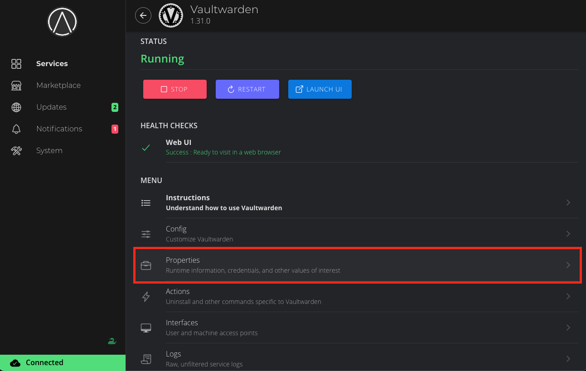
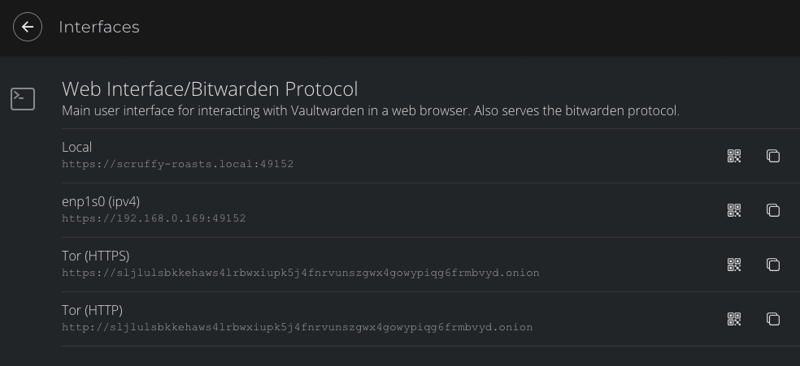
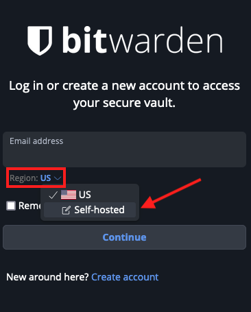
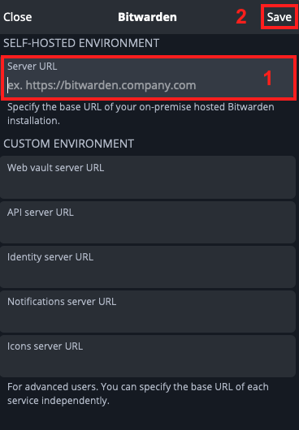

# Bitwarden Client Setup

Here you can learn how to setup your various devices and browsers to be able to access your Vaultwarden service.

We suggest you connect to Vaultwarden over [VPN or Tor](/user-manual/connecting-remotely.md) for the best experience… an experience where you can access synced passwords **away from home** as well as create and save new passwords. Over LAN your app and all your passwords will be cached and available after an initial sync when not connected to your Start9 Server but you would later need to connect via LAN to add or update passwords in your vault.

**Contents**
- [Browser Extension](#browser-extension)
- [Android](#android)
- [iOS](#ios)
- [Desktop Clients](#desktop-clients)


## Browser Extension

```admonish tip

If you intend on connecting via **Tor** (i.e using the .onion address) rather than VPN the Bitwarden browser extension will only work with a Tor enabled browser.

If you choose **Firefox with Tor**, you will need to [follow this guide](/misc-guides/firefox-guides/tor.md) to run Tor on your device and configure Firefox to use it. If using **Brave** you will just need to [setup Tor on your device](/src/user-manual/connecting-remotely.md#connecting-over-tor). With Tor Browser, everything will just work right out of the box.

We recommend using Firefox as it is the most compatible browser with Start9 Servers.

```

1. In this example we will use Firefox, though these instructions will work just the same for Brave. First, install the [Bitwarden browser extension](https://addons.mozilla.org/en-US/firefox/addon/bitwarden-password-manager/).  

1. Head to the "Interfaces" tab in the Vaultwarden service on your Start9 Server:

    


1. Copy the preferred interface address for VPN/LAN or Tor:

    


1. Now head to the Bitwarden extension and click the "Region" dropdown menu and choose self-hosted. Under **Self-hosted environment** you will see a field for **Server URL**.

    


1. Now you need to grab the address of your Vaultwarden server. Paste the address into your extension and click "Save".

    


1. Now enter your credentials and the Bitwarden extension will be logged into your self-hosted Vaultwarden server!


## Android


1. Visit your app store of choice and download the Bitwarden app.

1. Next, open the Bitwarden app. You'll be greeted with a log-in screen. Choose the "Self-hosted" option on the drop-down menu. Choose the "Self-hosted" option. 

1. Head to the "Interfaces" tab in the Vaultwarden service on your Start9 Server:

    

    ```admonish tip

    If connecting via **Tor** rather than VPN (i.e using the .onion address) the Bitwarden app will only work if [Tor is enabled](/src/device-guides/android/tor.md) on your device and Bitwarden is added to Orbot's VPN apps list. You may need to hit the refresh button in the top left to get it to populate.

    ```

1. Copy the preferred interface address for VPN/LAN or Tor:

    


1. Now send that address to your phone and paste it into Bitwarden.

1. Hit save.

1. Go ahead and tap 'Log In,' enter your credentials, and you can access your Bitwarden app / Vaultwarden server.


## iOS

1. Visit the App Store and download the [Bitwarden app](https://apps.apple.com/app/bitwarden-password-manager/id1137397744)

1. Next, open the Bitwarden app. You'll be greeted with a log-in screen. Click the "Region" drop-down menu.

    


1. Choose the "Self-hosted" option.  

    

1. Head to the "Interfaces" tab in the Vaultwarden service on your Start9 Server:

    

    ```admonish tip

    If connecting via **Tor** rather than VPN (i.e using the .onion address) the Bitwarden app will only work if [Tor is enabled](/src/device-guides/android/tor.md) on your device and Bitwarden is added to Orbot's VPN apps list. You may need to hit the refresh button in the top left to get it to populate.

    ```

1. Copy the preferred interface address for VPN/LAN or Tor:

    


1. Now send that address to your phone and paste it into Bitwarden.

    ```admonish warning
    
    **For Tor, before you hit save:**  The Tor address you will have copied will begin with **http** - Please change this to **https** instead of **http**

    ```

    


1. Now you can hit save, and you'll be returned to the log-in screen.

1. Go ahead and tap 'Log In,' enter your credentials, and you'll be able to access your Bitwarden app / Vaultwarden server!


## Desktop Clients

### Linux
1. Install Bitwarden either by using a package manager like **apt** (we recommend against using **snap**) or download it from [here](https://bitwarden.com/download/).

1. If you intend to use Tor, run the program with the flag ``--proxy-server=socks5://127.0.0.1:9050`` behind it. You can run this from a terminal, and if you'd like to use a shortcut, edit that shortcut file to include the flag.

1. Choose the "Self-hosted" option, paste the preferred interface address for VPN/LAN or Tor:

    

1. Hit save and log in.


### MacOS
1. Download the [Bitwarden Desktop app](https://bitwarden.com/download/).

1. If you intend to use Tor, make sure Tor is [running on your Mac](/device-guides/mac/tor.md). If you intend to use a VPN, make sure you have it [running on your Mac](/device-guides/mac/vpn.md).

1. Choose the "Self-hosted" option, paste the preferred interface address for VPN/LAN or Tor:

    

1. Hit save and log in. 


### Windows
1. Download the [Bitwarden Desktop app](https://bitwarden.com/download/).

1. If you intend to use Tor, make sure Tor is [running on Windows](/device-guides/windows/tor.md). If you intend to use a VPN, make sure you have it [running on your Mac](/device-guides/windows/vpn.md).

1. Choose the "Self-hosted" option, paste the preferred interface address for VPN/LAN or Tor:

    

1. Hit save and log in. 