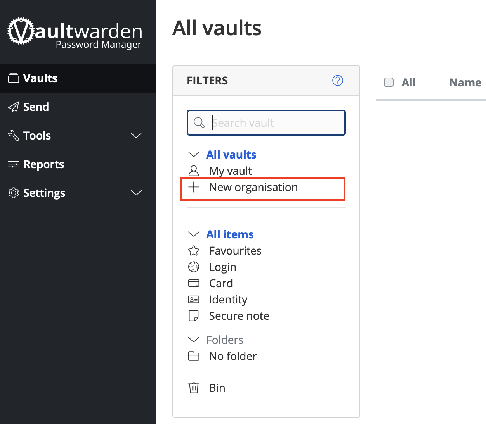
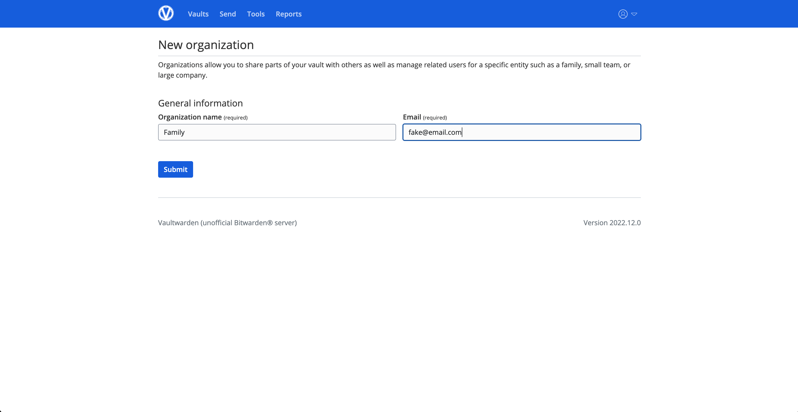
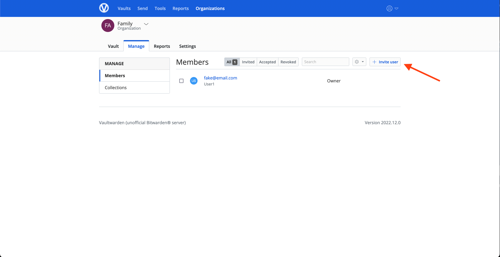
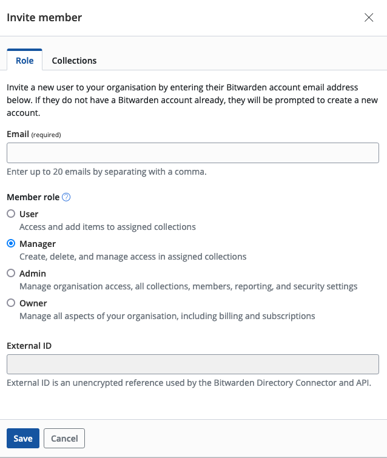
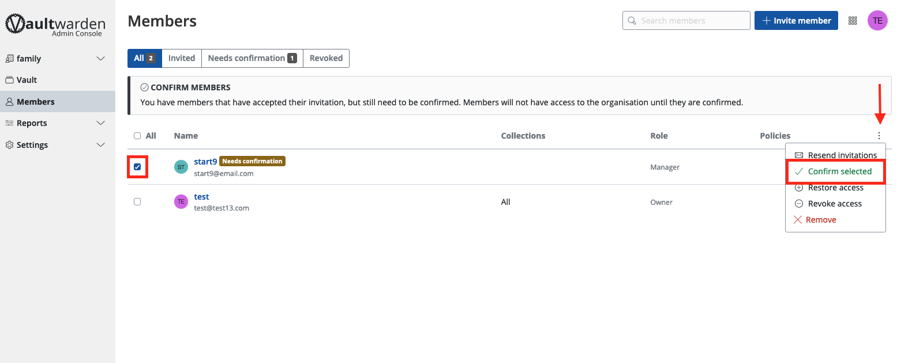
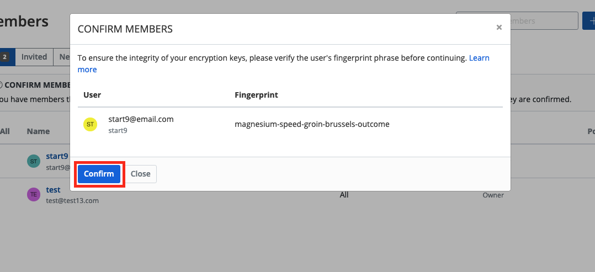

# Organizations in Vaultwarden

## Creating an Organization

If you want to share passwords amongst friends or family, you can do so using the **Organizations** feature of Vaultwarden.

1. Inside your [Web Vault](vaultwarden-webvault), click `New Organization`

    

1. Give your organization a name and enter your email.

    ```admonish note
    You can enter whatever you want for email, even **fake@email.com**. Because you are self-hosting, the email is not used for anything at all.
    ```

    


## Adding Others to Your Organization

```admonish warning
   After you have completed signed up new members to your Vaultwarden server, it is highly recommended that you disable new user signups inside your `Vaultwarden Admin Dashboard` --> General Settings --> Allow new signups --> uncheck the box.
```

1. Tell the user to create an account on your Vaultwarden server. This must be done *before* you invite them.

1. Inside the Organization page, click Members --> `Invite member`

    

1. Decide what permissions you want the member to have and click "Save". In the below example, the member will be a manager.

    

1. The new member should automatically show as `Needs confirmation`. If the user shows as `Invited`, Remove their account by clicking the settings icon to the right of their email address, and make sure they create account *before* you invite them, as mentioned in Step 1.  Once they show as `Needs confirmation`, select user checkbox and click the settings icon on the right and click "Confirm selected".

    

1. You will be presented with a fingerprint phrase. The new member can verify this phrase inside their own dashboard, but because you are self-hosting and adding users manually, you can just click "Confirm".

    

The new member should now be able to see the organization in their own dashboard or client apps.
