# Initial Setup

## Web Vault

1. Ensure Vaultwarden is running - click **START** on your Start9 Server if not:

    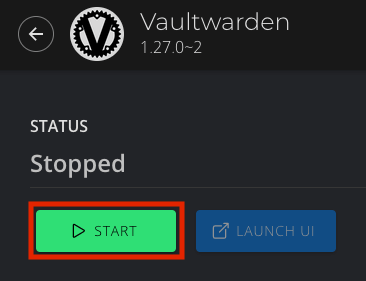


1. Once the health check turns green, click **Launch UI**:

    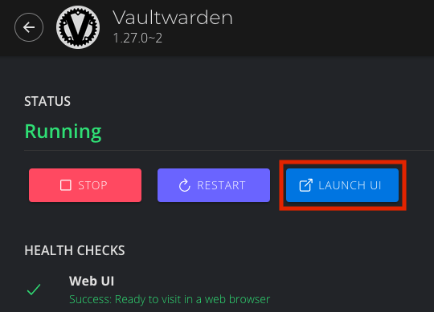


1. Time to create an account! Click **Create account**:
        
    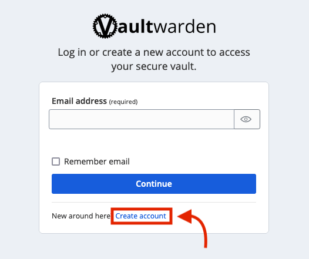


    ```admonish note
    
    You are creating an account with yourself on your own Vaultwarden website served from your own Vaultwarden server - there are no third parties involved here. 

    ```


1. Enter an email address for login:

    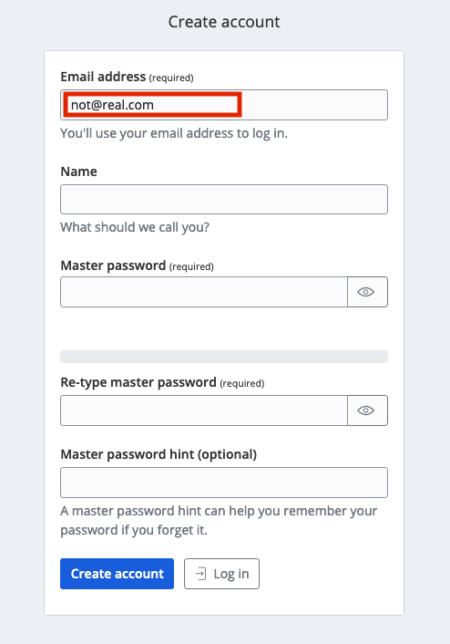

    ```admonish tip

    This email address can be anything you like. It doesn't have to be real. It is simply a way for you to log into Vaultwarden from Bitwarden apps on your devices. Your Vaultwarden server won't ever email you.

    ```

    ```admonish tip

    You cannot use this email address to reset your master password - it is simply used to create an account on your server. 

    ```

    ```admonish warning

    Do not lose it - you will not be able to log in without it!

    ```

1. Enter a name for the account, a strong password and (optionally) a password hint - then click **Create account**:

    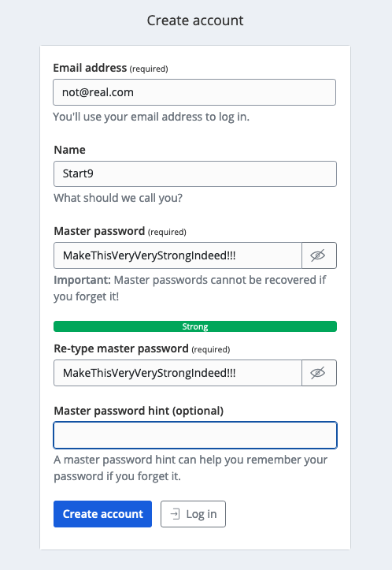


    ```admonish warning

    It is important to realize that this is the **Master password** for all your other passwords. Make it very strong, memorize it, write it down, and back it up to a safe place. If you lose it, you may lose access to all your passwords and your entire digital life.

    ```

1. Now you can log in to your new password manager! Enter your email to login:

    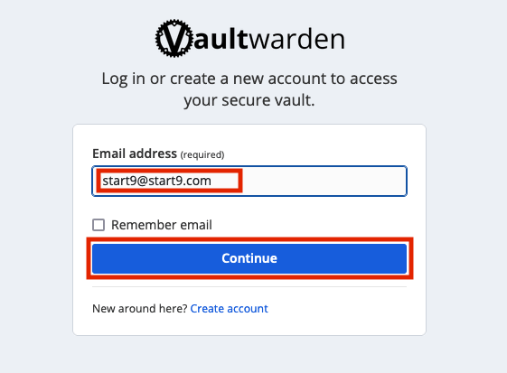


1. Then your master password:

    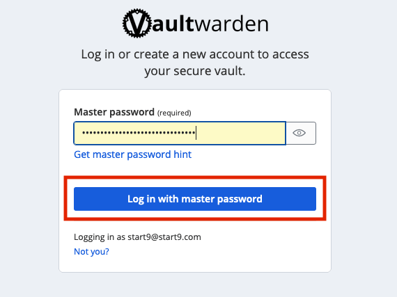


1. We are greeted with our newly setup Vaultwarden password vault!

    
    

1. On the left, you can access **Tools** for reports and the password generator. You can also import data from other programs, such as LastPass, 1Password, or KeePass!

    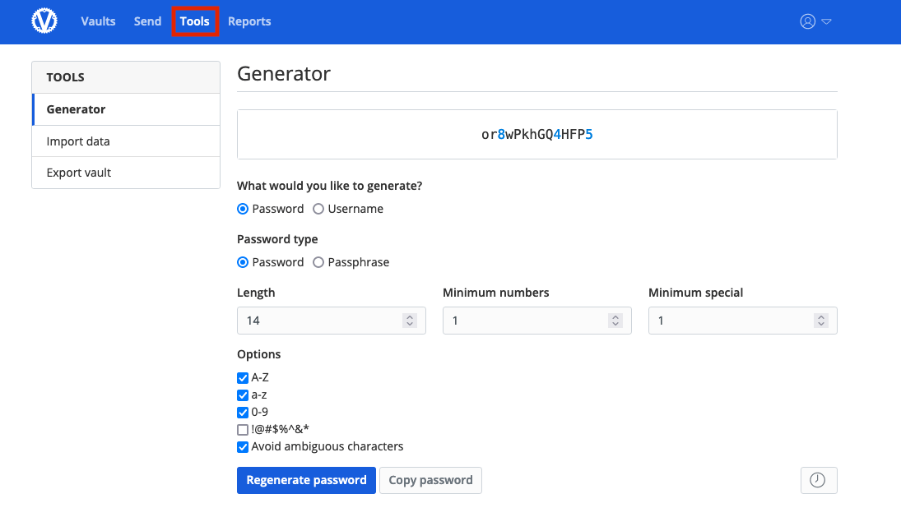


1. **Account settings** gives you all your options, including the ability to set up 2 factor authorization.

    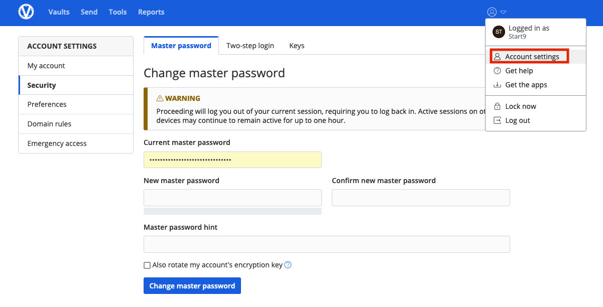


1. Now you're ready to start storing some passwords!


## Storing your first password

1. Back at the main page for your vault, let's do a quick example login. We'll start by creating a folder for it:

    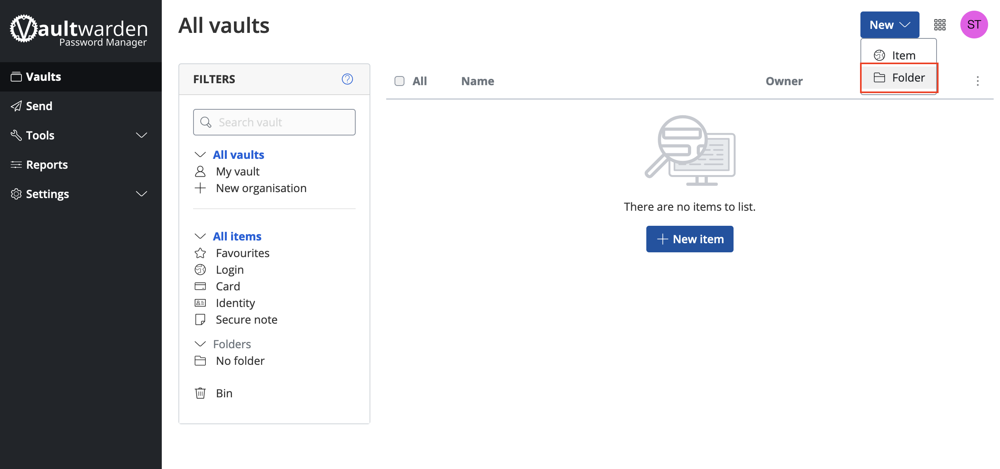


1. Name the folder and click **Save**:

    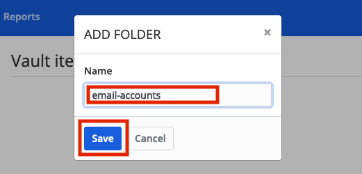


1. Click **New item**:

    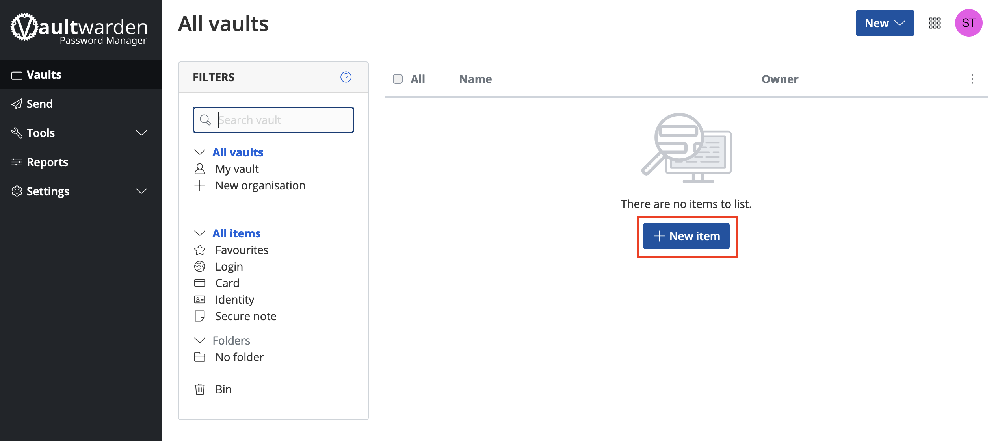


1. Now add the credentials and click **Save**:

    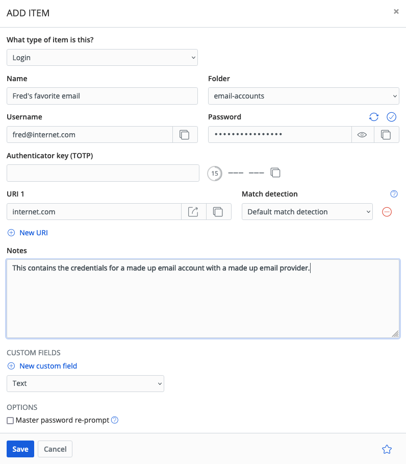


    An entry can have multiple URLs - for example you may wish to enter both an onion address and a .local address for one of the services you have running on your server. We are increasing the numbers of ways in which you can connect to your services, soon they may even have simple .com addresses!

1. And there we have it - our first set of login credentials.

    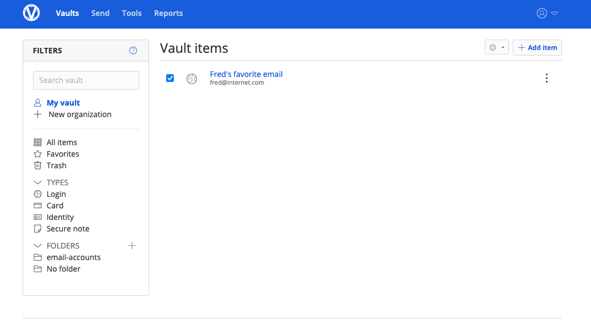


Congratulations! You have setup your own self-hosted password manager and have added a set of login credentials to it!


## Accessing the Admin Console


1. You will find the Admin URL by heading to "Properties" on the Vaultwarden Service page.  

    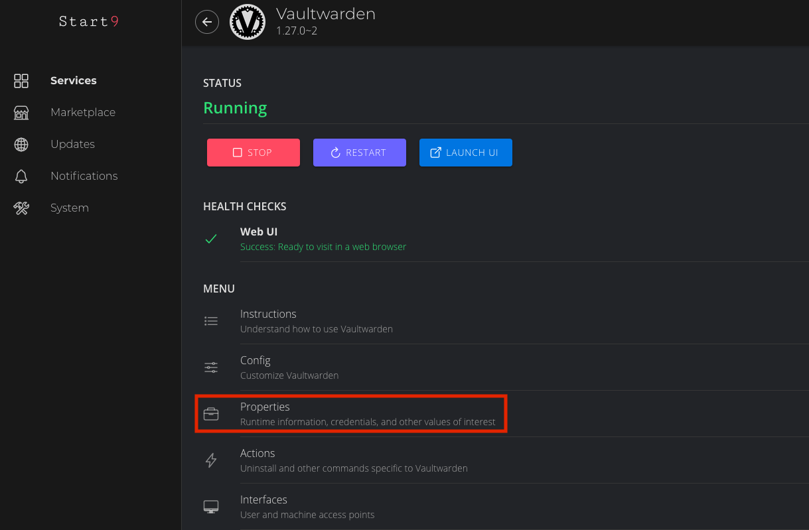
 

1. Copy either of the addresses here and paste in the browser.

    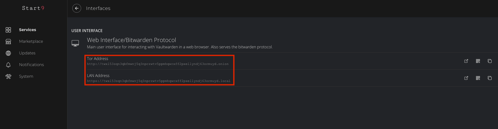


1. You will be prompted for your "Admin Token," which can be found on the same page.

    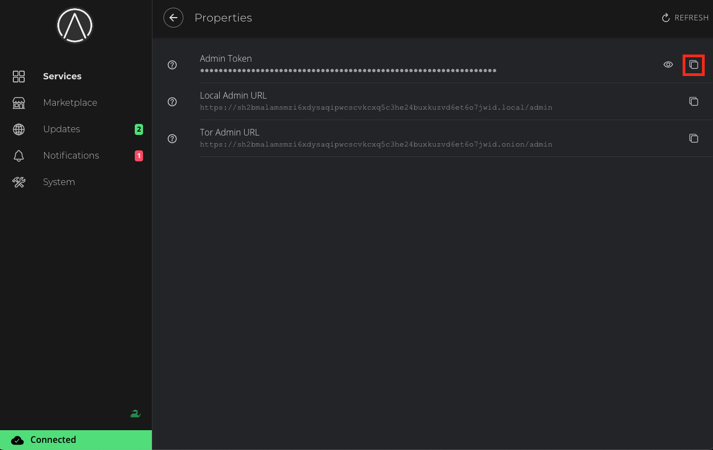

1. Paste it on Admin page:

    


1. You're now logged in to the admin panel.

    


    ```admonish warning
    
    This **cannot** be used to reset passwords for accounts created on your Vaultwarden server.

    ```

Now you'll want to setup some client devices! [Head here for instructions on how to do so](./bitwarden-setup.md).