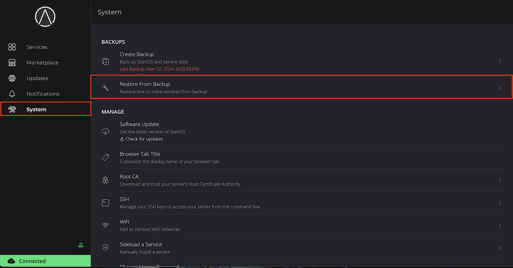
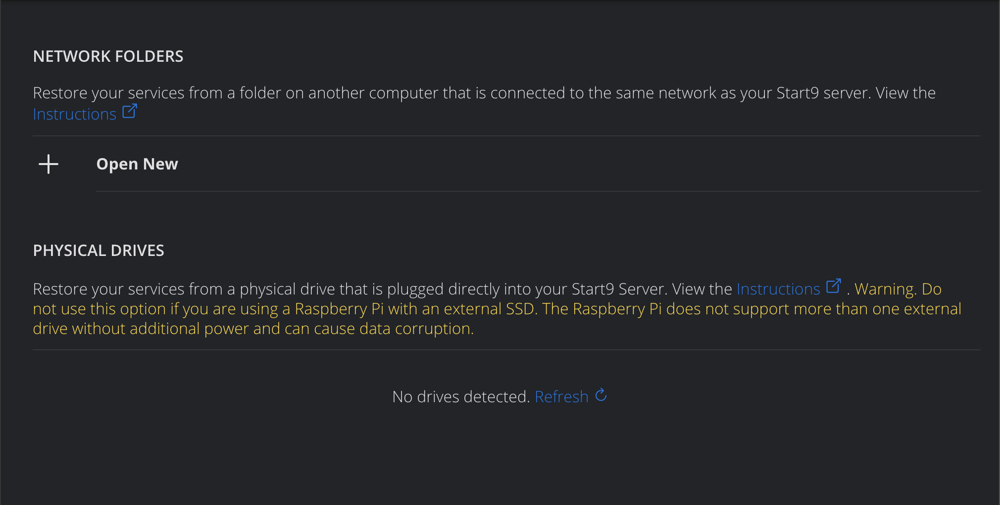
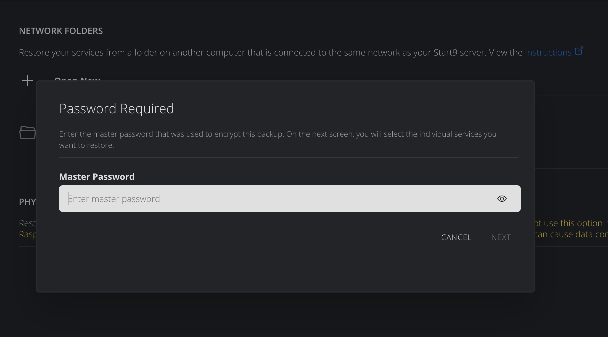

# Restoring Backups

#### Contents

- [Restoring Individual Services](#restoring-individual-services)
- [Restoring an Entire Server](#restoring-an-entire-server)

## Restoring Individual Services

This option should only be necessary if you accidentally uninstall a service.

1.  Go to System > Restore from Backup.

    

1.  Select your backup drive.

    

1.  Decrypt the backup drive by entering the password that was used to create it.

    

1.  Select the service(s) you want to restore and click "Restore Selected".

    

## Restoring an Entire Server

If your StartOS data drive is lost or corrupted and you need to restore your entire server, follow instructions [here](./recover.md#restore-from-backup-disaster-recovery).
