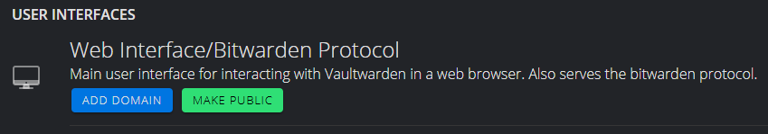

# Connecting Remotely

#### Contents

- [Connecting over Router VPN](#connecting-over-router-vpn)
- [Connecting over Tor](#connecting-over-tor)
- [Connecting using WireGuard Script and a VPS](#connecting-using-wireguard-script-and-a-vps)

## Connecting over Router VPN

**Prerequisite**

- [Trusting Your Root CA](./trust-ca.md)

Most modern routers have VPN functionality built-in. Refer to your router's user manual for instructions to complete the following steps.

1. Assign a static IP address to your server.

2. Enable your router's VPN.

   ```admonish tip title="Enable Dynamic DNS (Optional)"

   Rarely, your ISP may unexpectedly change your home IP address. If this happens, it will break your VPN connection until you re-complete the steps below. To prevent this, you can enable Dynamic DNS in your router, which is usually a paid service. To learn more about Dynamic DNS, click [here]().
   ```

3. Download your VPN config file from your router.

4. Install OpenVPN on your client device(s) and establish a VPN connection to your LAN using the config file from above.

## Connecting over Tor

```admonish warning

It is normal for Tor connections to be slow or unreliable at times.
```

### Using a Tor Browser

You can connect to your server from anywhere in the world, privately and anonymously, by visiting its unique `http://....onion` URL from any Tor-enabled browser.

**Recommended Browsers**

- **Mac, Linux, Windows, Android/Graphene**: <a href="https://torproject.org/download" target="_blank">Tor Browser</a>
- **iOS**: <a href="https://onionbrowser.com" target="_blank">Onion Browser</a>

### Running Tor in the _background_ on your Phone/Laptop

By running Tor on your phone or laptop, certain apps will be able to connect to your server over Tor, even if the apps themselves do not natively support Tor. Select the guide specific to your phone/laptop:

- [Mac](../device-guides/mac/tor.md)
- [Linux](../device-guides/linux/tor.md)
- [Windows](../device-guides/windows/tor.md)
- [Android/Graphene](../device-guides/android/tor.md)
- [iOS](../device-guides/ios/tor.md)

## Connecting using WireGuard Script and a VPS
Connecting over your Router VPN will expose your home IP address. If you don't want to do that you can rent a small Virtual Private Server (VPS) with a static IP address, then create a WireGuard VPN connection between the VPS and your StartOS server. This will only expose the VPS IP address and not your of your home IP address while forwarding and returning requests to your StartOS server. Only the VPS provider will be aware of your home IP address and likely geographic location. This setup allows you to access your StartOS server or its services by browsing to the VPS IP address or a domain name you point to it. StartOS includes a WireGuard VPS setup script to automate this... 

**Prerequisites**
- You will need the IP address (IPv4) of your VPS server and the root password
- SSH access to your StartOS server - [Using SSH](../user-manual/ssh.html)

### 1. SSH to your StartOS server.  
Once connected, run the command below replacing ###.###.###.### with the IPv4 address of your VPS:

```wg-vps-setup -i ###.###.###.###```

- You will be prompted for the VPS root password (not your StartOS password)
- You will be asked if you'd like the script to attempt to add the same SSH to the VPS
- You will be prompted for a port for WireGuard to listen on and a name for the client. If you don't need to customize just accept the defaults, hit enter and continue.
- The script will execute - installing necessary packages and configuring WireGuard. Unless there is an issue it will conclude with WireGuard server setup complete!

   ```admonish tip

   To verify everything is working use the following command:

   ```nmcli c show```

   You will see an entry with your StartOS server name (first 15 characters) of type `wireguard`.

   ```


### 2. Configure ACME (Automantic Certificate Management Environment).  
This will allow you to generate SSL certificates (for https) to later add domains and point them to services or to StartOS itself. 

In StartOS go to `System -> Manage -> ACME`. If you don't have your own provider, select Let's Encrypt and provide an email address.  You can enter any email address you like here. When done it will look like this:


### 3. Configure StartOS and Services to be accessible via public IP address

#### For the StartOS dashboard UI
Go to System -> Insights -> About -> Web Addresses.  You will see the various ways you can access your StartOS server.  

   ```admonish warning

   You may not need or want to expose your entire StartOS publicly on the internet. If you're looking to expose individual services, see the [next section](#for-each-service). If you want to access your StartOS dashboard UI away from home without exposing it public, you may want to instead connect over [Router VPN](#connecting-over-router-vpn) or [Tor](#connecting-over-tor).

   ```

Click the Make Public button to allow access via your VPS IP address


You can test this by clicking the open in a new window button on the right hand side of that row.  You can also display the QR code for the link or copy the link to the clipboard.

#### For each service
Select the service you want to reach via clearnet. Click on Interfaces, then click the Make Public button to allow access via your VPS IP address and port number.



You can test this by clicking the open in a new window button on the right hand side of that row. You can also display the QR code for the link or copy the link to the clipboard.   

### 4. Point your domain to your VPS and let StartOS map subdomains to services

#### Update your domain to point to your VPS
- Login to an interface provided by your domain registrar and find the domain name you wish to use. Add a new A record with `*.yourdomain.com` and the IP address of your VPS running wireguard.  If your VPS IP address is `172.67.1.1` and your domain name is `johnsmith.com` the A record would have name of `*.johnsmith.com`, Type of "A", record of `172.67.1.1` and TTL of your chosing.

- After adding the A record it may take some time to propogate. You can check propagation using a website like dnschecker.org

   ```admonish tip
   
   You should test the DNS setup by trying to ping to any subdomain and confirm it reaches the VPS IP address. 

   For example, `ping test.johnsmith.com` should return `172.67.1.1` (or whatever your actual IP address is). At this point if you use your web browser to try browsing to a subdomain it will direct the request to your VPS which will route via Wireguard to your StartOS server.  You next have to configure StartOS to respond to these subdomain based requests.
   
   ```

   ```admonish tip

   If you run multiple servers and want to direct sub domains to different servers, create the A records manually and point them to different IP addresses instead of using the `*.` wildcard.

   ```

#### Configure StartOS services to respond to domain based web requests
- Select the service you want to reach via domain name.
- Click on `Interfaces` and then click the `Add Domain` button to allow access via domain name.
- Select `Standard` type (not TOR), enter the domain name you want this service to respond to and the ACME Provider you set up earlier.
- Save that and you will now see that in addition to the IP based access (and local access) you can now access this service by the  domain name you specified (no port required).  


