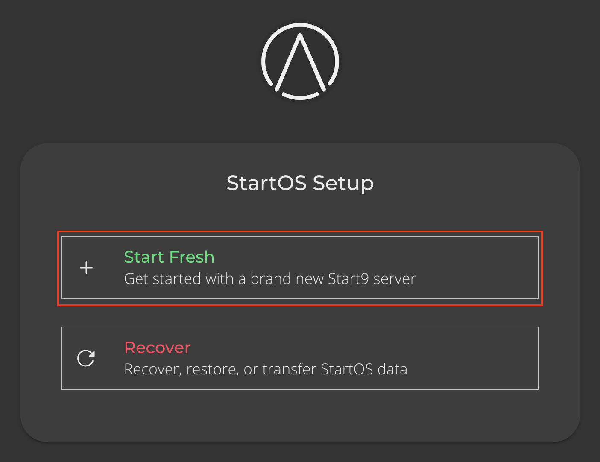

# Starting Fresh

1. Click "Start Fresh".

   

1. Select your data drive.

   ```admonish warning
   Any data on this drive will be _permanently erased_!
   ```

   

1. Create a password.

   

1. Your server will initialize.

   

1. Download StartOS-info.html.

   

1. Continue to [trusting your server's Root CA](../trust-ca.md).
