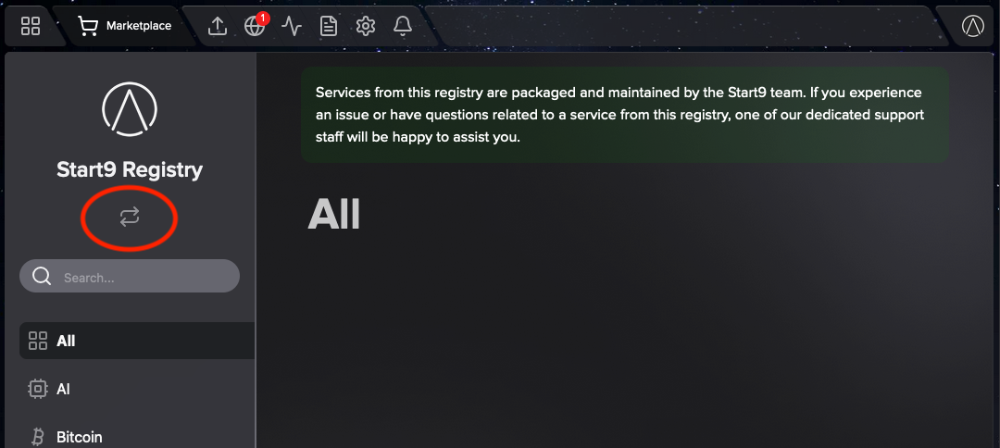
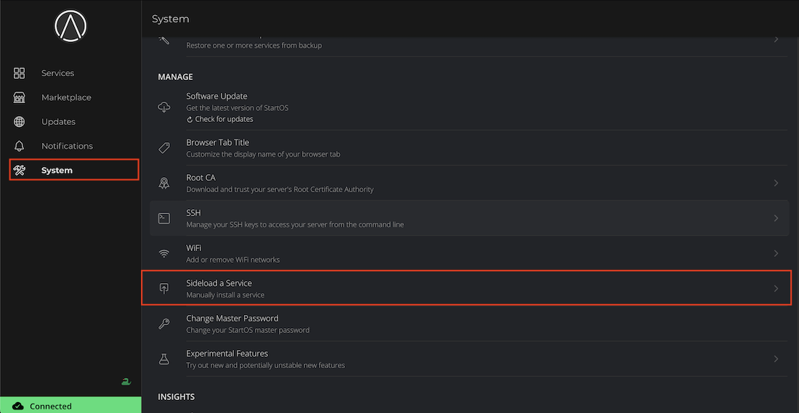
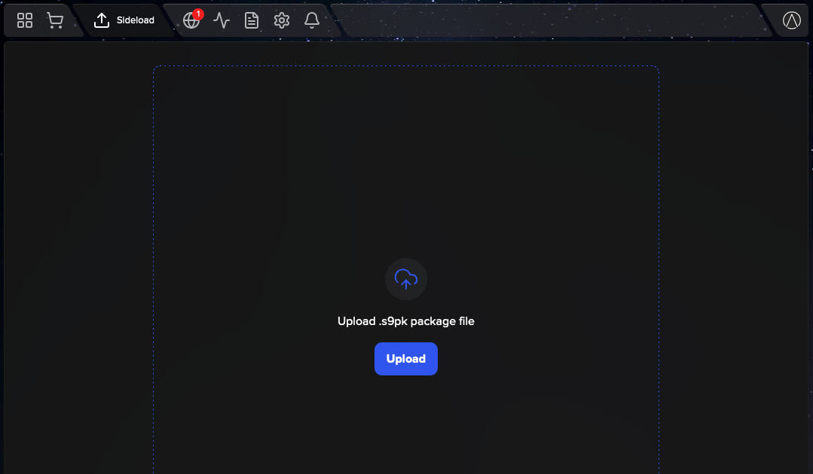

# Installing Services

#### Contents

- [Installing from the Marketplace](#installing-from-the-marketplace)
- [Sideloading](#sideloading)

## Installing from the Marketplace

The Marketplace is made up of multiple "registries". A registry is a curated list of services that can be downloaded and installed onto StartOS. You can think of a registry as just one "store" or "booth" inside a broader marketplace.

StartOS comes preloaded with two default registries: (1) The Start9 Registry and (2) the Community Registry.

Services in the Start9 Registry are vouched for, recommended, supported, and maintained by Start9. Services in the Community Registry are not. For a more detailed explanation of the Registry framework, check out this short <a href="https://blog.start9.com/start9-marketplace-strategy" target="_blank">blog post</a>.

To install a service from the marketplace, simply visit the Marketplace, select a service, and click "Install".

### Switching Registries

To switch between registries or add a custom registry, simply click "Change" underneath the current Registry title.

## Sideloading

Sideloading is useful if you are testing a service that does not yet exist on a registry, or if you prefer to eliminate the Marketplace as a point of trust. An s9pk can be obtained from anywhere or even built from source code.

To sideload a service, go to `System > Sideload a Service` and upload the appropriate .s9pk file.

