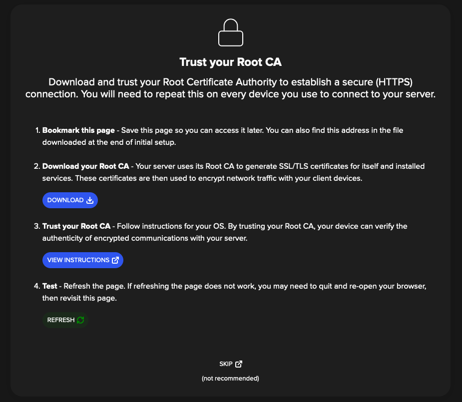
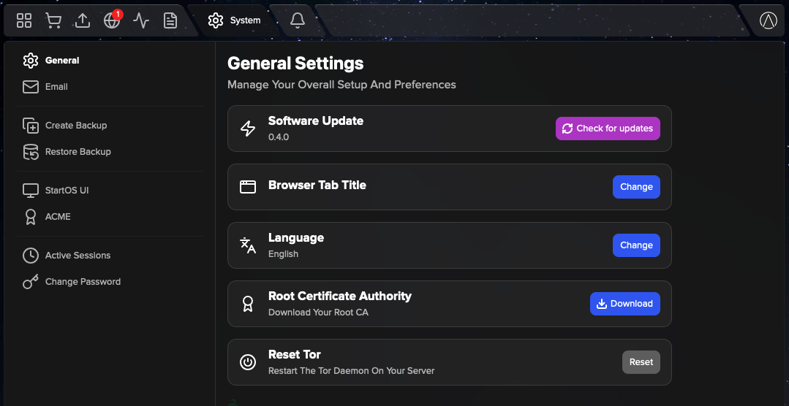

# Trusting Your Root CA

To establish a secure (HTTPS) connection with your server, it is necessary to download and trust your server's Root Certificate Authority (Root CA).

**Contents**

- [Download Your Root CA](#download-your-root-ca)
- [Trust Your Root CA](#trust)

## Download your Root CA

There are multiple ways to download your Root CA.

1. From the HTTP login screen.

   Visit your server's `http://<adjective-noun>.local` URL.

   

1. From your StartOS-info.html file.

   Following initial setup, you were required to download a StartOS-info.html file. Your Root CA can be downloaded from this file.

   

1. Over Tor.

   You can securely access your server using its `http://....oinion` URL from any Tor-enabled browser. From there, you can download your Root CA by going to `System -> Root CA`.

   

1. Sending to yourself.

   Once you have downloaded your Root CA on one device, you can simply send the file to yourself using email, messaging app, or other file sharing technique.

## Trust your Root CA

Select your client device OS and follow instructions

- [Linux](../../guides/device-guides/linux/ca.md)
- [Mac](../../guides/device-guides/mac/ca.md)
- [Windows](../../guides/device-guides/windows/ca.md)
- [Android/Graphene](../../guides/device-guides/android/ca.md)
- [iOS](../../guides/device-guides/ios/ca.md)
