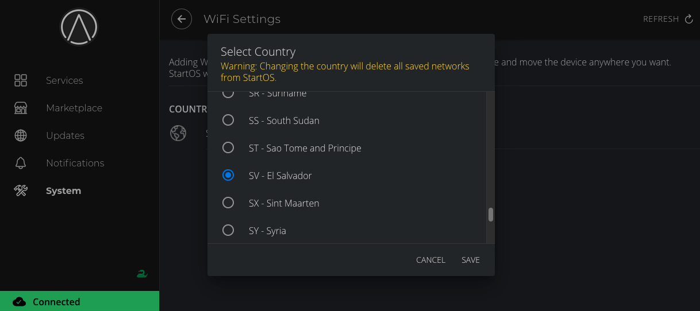
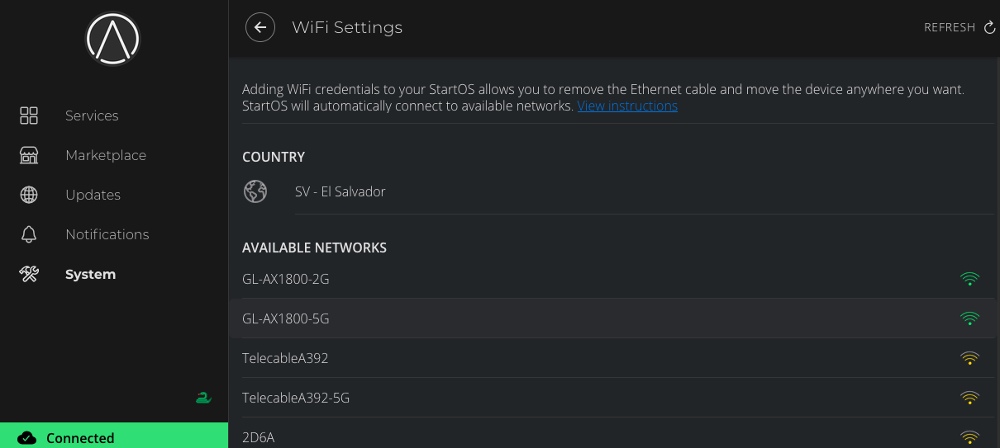
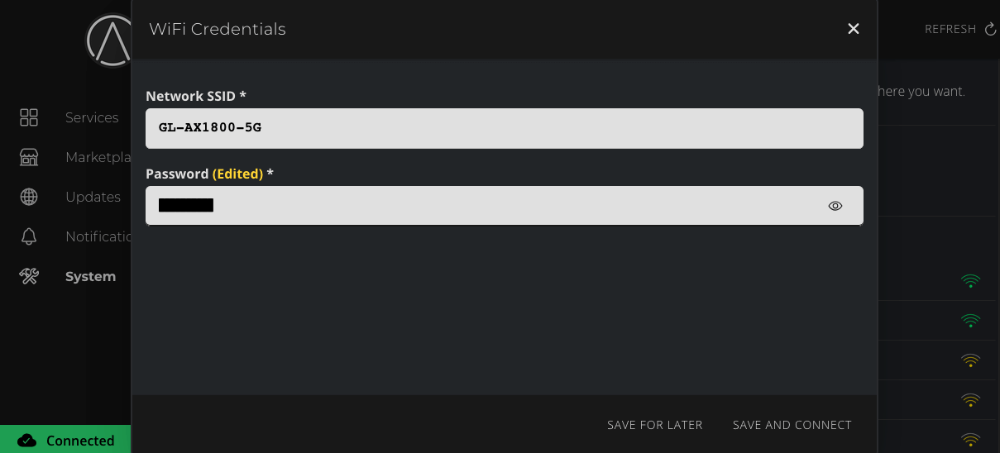

# Using WiFi

Servers are intended to be online 24/7 and a direct Ethernet connection is always faster, more stable and more reliable than WiFi. We recommend against using WiFi.

Your server does not need to be in the same room as you. You do not need to access it physically. You do not need to see it or touch it for it to serve a web interface on your network. It can live with your router with a direct ethernet connection.

However, WiFi can **sometimes** be necessary, such as in a school or office setting where Ethernet connections are not available.

Your server may or may not come with a built-in WiFi adapter.


## No WiFi adapter

If your device does not have a WiFi adapter, we recommend using a WiFi extender.

You connect the WiFi extender to the available WiFi network, then you connect your StartOS server to the WiFi extender using Ethernet. It is that easy.

The WiFi extenders below have been tested to work with StartOS, but other extenders should also work.

- <a href="https://www.amazon.com/TP-Link-AC750-WiFi-Range-Extender/dp/B07N1WW638" target="_blank">https://www.amazon.com/TP-Link-AC750-WiFi-Range-Extender/dp/B07N1WW638</a>

- <a href="https://www.amazon.com/Wifi-Extender-Booster-Wireless-Repeater" target="_blank">https://www.amazon.com/Wifi-Extender-Booster-Wireless-Repeater</a>


## WiFi adapter built-in

### Connecting to a WiFi network in StartOS

You should have already set up your server in a location with ethernet and be able to log in from a client machine.

1. Under System > WiFi select your country (this is for limiting to local civilian radio frequencies)

    

1. Choose your WiFi network

    

1. Enter your WiFi password and click `Save and Connect`
    
    

That's it!

```admonish tip

You should use either wired ethernet or WiFi to connect your server, it isn't recommended that you use both at the same time.

```

```admonish warning

WiFi is consistantly less easy to work with than wired ethernet and is not a recommended solution. Common issues include:

- WiFi networks set up on routers being seperate networks (i.e. "guest" networks or a different subnet)
- Dropped connections confused with the server being down
- Issues with routers when wired ethernet and WiFi are both connected

These can make it difficult to troubleshoot when contacting support.

```


